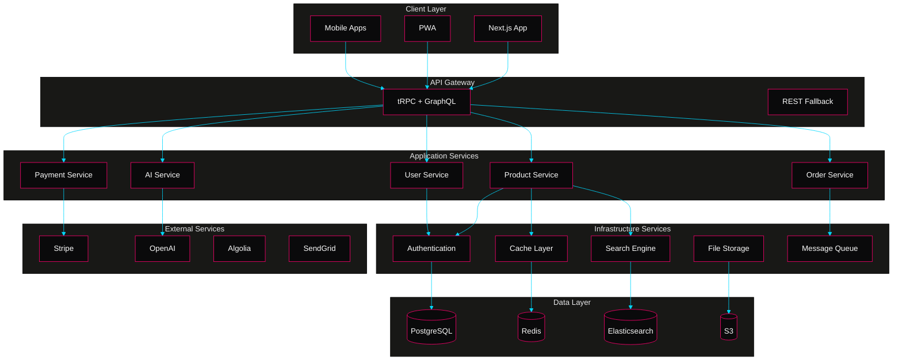
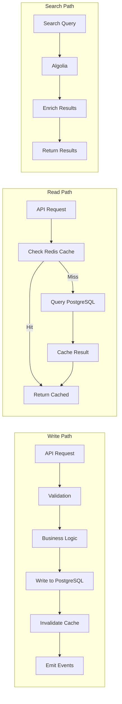
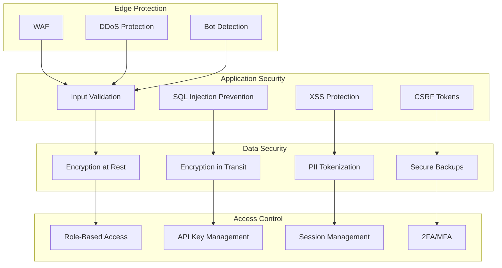
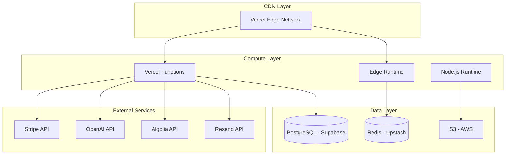

# 🏗️ **LuxeVerse - Project Architecture Document**
### *The Complete Blueprint for Building the Future of Luxury E-Commerce*

---

## 📋 **Document Overview**

| Section | Purpose |
| :------ | :------ |
| [1. Architectural Philosophy](#1-architectural-philosophy) | Core principles guiding system design |
| [2. System Architecture](#2-system-architecture) | Multi-layered application architecture |
| [3. Technology Stack](#3-technology-stack) | Comprehensive technology matrix |
| [4. Data Architecture](#4-data-architecture) | Database design and data flow |
| [5. Component Architecture](#5-component-architecture) | Frontend component hierarchy |
| [6. API Architecture](#6-api-architecture) | Backend service design |
| [7. Security Architecture](#7-security-architecture) | Multi-layer security implementation |
| [8. Performance Architecture](#8-performance-architecture) | Optimization strategies |
| [9. Infrastructure Architecture](#9-infrastructure-architecture) | Cloud and deployment design |
| [10. Implementation Roadmap](#10-implementation-roadmap) | Step-by-step execution plan |

---

## 1. **Architectural Philosophy**

### 🎯 **Core Design Principles**

Our architecture is built on five foundational pillars:

1. **Experience-First Design** - Every technical decision prioritizes user experience
2. **Scalable Foundation** - Built to handle exponential growth from day one
3. **Developer Ergonomics** - Clean, intuitive patterns that accelerate development
4. **Security by Default** - Protection built into every layer
5. **Performance Obsession** - Sub-second interactions globally

### 🏛️ **Architectural Patterns**

| Pattern | Implementation | Benefit |
| :------ | :------------- | :------ |
| **Domain-Driven Design** | Bounded contexts for commerce, user, AI | Clear separation of concerns |
| **Event-Driven Architecture** | Event bus for async operations | Scalable, decoupled services |
| **CQRS** | Separate read/write models | Optimized performance |
| **Repository Pattern** | Abstract data access | Testable, maintainable |
| **Dependency Injection** | IoC container | Flexible, testable code |

---

## 2. **System Architecture**

### 🏗️ **High-Level Architecture Overview**



### 📐 **Layered Architecture Design**

```typescript
// Layer definitions with clear boundaries
export const architectureLayers = {
  presentation: {
    components: ['React', 'Next.js', 'Tailwind CSS'],
    responsibilities: ['UI rendering', 'User interaction', 'Client-side state']
  },
  
  application: {
    components: ['tRPC procedures', 'Business logic', 'Validation'],
    responsibilities: ['Use case orchestration', 'Transaction management']
  },
  
  domain: {
    components: ['Domain models', 'Business rules', 'Domain events'],
    responsibilities: ['Core business logic', 'Entity behavior']
  },
  
  infrastructure: {
    components: ['Database', 'External APIs', 'File storage'],
    responsibilities: ['Technical capabilities', 'External integrations']
  }
}
```

---

## 3. **Technology Stack**

### ⚡ **Core Technologies Matrix**

| Layer | Technology | Version | Purpose | Justification |
| :---- | :--------- | :------ | :------ | :------------ |
| **Framework** | Next.js | 14.2.x | Full-stack React framework | SSR/SSG/ISR, App Router, Edge Runtime |
| **Language** | TypeScript | 5.5.x | Type-safe JavaScript | Developer productivity, fewer bugs |
| **Styling** | Tailwind CSS | 3.4.x | Utility-first CSS | Rapid development, consistent design |
| **UI Components** | Shadcn/UI | Latest | Accessible components | Customizable, well-tested |
| **Animation** | Framer Motion | 11.x | React animations | Smooth, performant animations |
| **State Management** | Zustand | 4.5.x | Client state | Simple, performant, TypeScript-first |
| **Data Fetching** | TanStack Query | 5.x | Server state | Caching, synchronization |
| **API Layer** | tRPC | 11.x | Type-safe API | End-to-end type safety |
| **ORM** | Prisma | 5.16.x | Database toolkit | Type-safe queries, migrations |
| **Database** | PostgreSQL | 16.x | Primary datastore | ACID compliance, JSON support |
| **Cache** | Redis | 7.4.x | In-memory cache | Session storage, query cache |
| **Search** | Algolia | Latest | Search service | Instant search, typo-tolerance |
| **Authentication** | NextAuth.js | 4.24.x | Auth solution | Multiple providers, secure |
| **Payments** | Stripe | Latest | Payment processing | Global support, PCI compliant |
| **File Storage** | AWS S3 | Latest | Object storage | Scalable, CDN integration |
| **Email** | Resend | Latest | Transactional email | Developer-friendly, React Email |
| **Monitoring** | Vercel Analytics | Latest | Performance monitoring | Real user metrics |
| **Error Tracking** | Sentry | Latest | Error monitoring | Real-time alerts, debugging |
| **Testing** | Vitest + Playwright | Latest | Test suite | Fast unit tests, E2E coverage |
| **CI/CD** | GitHub Actions | Latest | Automation | Integrated with repository |
| **Hosting** | Vercel | Latest | Edge deployment | Global CDN, serverless |

### 🔧 **Development Tools**

```json
{
  "devDependencies": {
    "@types/node": "^20.14.0",
    "@typescript-eslint/eslint-plugin": "^7.0.0",
    "@typescript-eslint/parser": "^7.0.0",
    "eslint": "^8.57.0",
    "eslint-config-next": "^14.2.0",
    "prettier": "^3.3.0",
    "prettier-plugin-tailwindcss": "^0.6.0",
    "husky": "^9.0.0",
    "lint-staged": "^15.2.0",
    "@commitlint/cli": "^19.0.0",
    "@commitlint/config-conventional": "^19.0.0"
  }
}
```

---

## 4. **Data Architecture**

### 🗄️ **Database Schema Design**

```prisma
// prisma/schema.prisma
generator client {
  provider = "prisma-client-js"
  previewFeatures = ["fullTextSearch", "postgresqlExtensions"]
}

datasource db {
  provider = "postgresql"
  url      = env("DATABASE_URL")
  extensions = [pgvector(map: "vector"), pg_trgm(map: "pg_trgm")]
}

// User domain
model User {
  id                String    @id @default(cuid())
  email             String    @unique
  emailVerified     DateTime?
  name              String?
  image             String?
  role              UserRole  @default(CUSTOMER)
  
  // Profile
  profile           Profile?
  addresses         Address[]
  paymentMethods    PaymentMethod[]
  
  // Commerce
  orders            Order[]
  cart              Cart?
  wishlists         Wishlist[]
  reviews           Review[]
  
  // AI/Personalization
  styleProfile      StyleProfile?
  searchHistory     SearchHistory[]
  viewHistory       ViewHistory[]
  
  // Meta
  createdAt         DateTime  @default(now())
  updatedAt         DateTime  @updatedAt
  
  @@index([email])
  @@index([createdAt])
}

// Product domain
model Product {
  id                String    @id @default(cuid())
  slug              String    @unique
  name              String
  description       String    @db.Text
  
  // Pricing
  price             Decimal   @db.Decimal(10,2)
  compareAtPrice    Decimal?  @db.Decimal(10,2)
  currency          String    @default("USD")
  
  // Inventory
  sku               String    @unique
  inventoryQuantity Int       @default(0)
  trackInventory    Boolean   @default(true)
  
  // Media
  images            ProductImage[]
  videos            ProductVideo[]
  
  // Categorization
  category          Category  @relation(fields: [categoryId], references: [id])
  categoryId        String
  collections       ProductCollection[]
  tags              ProductTag[]
  
  // Variants
  variants          ProductVariant[]
  options           ProductOption[]
  
  // SEO
  metaTitle         String?
  metaDescription   String?
  
  // AI
  embedding         Float[]   @db.vector(1536) // OpenAI embeddings
  aiTags            String[]
  
  // Status
  status            ProductStatus @default(DRAFT)
  publishedAt       DateTime?
  
  // Relations
  orderItems        OrderItem[]
  cartItems         CartItem[]
  wishlistItems     WishlistItem[]
  reviews           Review[]
  
  createdAt         DateTime  @default(now())
  updatedAt         DateTime  @updatedAt
  
  @@index([status, publishedAt])
  @@index([categoryId])
  @@index([sku])
}

// Order domain
model Order {
  id                String    @id @default(cuid())
  orderNumber       String    @unique @default(cuid())
  
  // Customer
  userId            String
  user              User      @relation(fields: [userId], references: [id])
  email             String
  
  // Items
  items             OrderItem[]
  
  // Pricing
  subtotal          Decimal   @db.Decimal(10,2)
  tax               Decimal   @db.Decimal(10,2)
  shipping          Decimal   @db.Decimal(10,2)
  discount          Decimal   @db.Decimal(10,2) @default(0)
  total             Decimal   @db.Decimal(10,2)
  currency          String    @default("USD")
  
  // Shipping
  shippingAddress   Json
  billingAddress    Json
  shippingMethod    String
  trackingNumber    String?
  
  // Payment
  paymentMethod     String
  paymentIntentId   String?
  
  // Status
  status            OrderStatus @default(PENDING)
  
  // Meta
  notes             String?
  metadata          Json?
  
  createdAt         DateTime  @default(now())
  updatedAt         DateTime  @updatedAt
  
  @@index([userId])
  @@index([status])
  @@index([createdAt])
}

// AI/Personalization domain
model StyleProfile {
  id                String    @id @default(cuid())
  userId            String    @unique
  user              User      @relation(fields: [userId], references: [id])
  
  // Preferences
  favoriteColors    String[]
  preferredStyles   String[]
  sizes             Json
  brands            String[]
  priceRange        Json
  
  // AI Analysis
  embedding         Float[]   @db.vector(1536)
  persona           String?
  
  createdAt         DateTime  @default(now())
  updatedAt         DateTime  @updatedAt
}

// Enums
enum UserRole {
  CUSTOMER
  VIP
  ADMIN
  SUPER_ADMIN
}

enum ProductStatus {
  DRAFT
  ACTIVE
  ARCHIVED
}

enum OrderStatus {
  PENDING
  PROCESSING
  SHIPPED
  DELIVERED
  CANCELLED
  REFUNDED
}
```

### 🔄 **Data Flow Architecture**



### 📊 **Database Optimization Strategies**

```sql
-- Performance indexes
CREATE INDEX idx_products_status_published ON products(status, published_at) WHERE status = 'ACTIVE';
CREATE INDEX idx_orders_user_created ON orders(user_id, created_at DESC);
CREATE INDEX idx_products_category_price ON products(category_id, price);

-- Full-text search
CREATE INDEX idx_products_search ON products USING gin(to_tsvector('english', name || ' ' || description));

-- Vector similarity search for AI recommendations
CREATE INDEX idx_products_embedding ON products USING ivfflat (embedding vector_cosine_ops);
```

---

## 5. **Component Architecture**

### 🧩 **Frontend Structure**

```
src/
├── app/                              # Next.js App Router
│   ├── (auth)/                       # Auth group routes
│   │   ├── login/
│   │   │   ├── page.tsx
│   │   │   └── loading.tsx
│   │   ├── register/
│   │   └── layout.tsx
│   ├── (shop)/                       # Main shop routes
│   │   ├── page.tsx                  # Homepage
│   │   ├── products/
│   │   │   ├── page.tsx              # Product listing
│   │   │   ├── [slug]/
│   │   │   │   ├── page.tsx          # Product detail
│   │   │   │   ├── loading.tsx
│   │   │   │   └── error.tsx
│   │   │   └── layout.tsx
│   │   ├── cart/
│   │   ├── checkout/
│   │   └── layout.tsx
│   ├── account/                      # Protected routes
│   │   ├── orders/
│   │   ├── wishlist/
│   │   ├── settings/
│   │   └── layout.tsx
│   ├── api/                          # API routes
│   │   ├── trpc/[trpc]/route.ts
│   │   ├── webhooks/
│   │   │   ├── stripe/route.ts
│   │   │   └── algolia/route.ts
│   │   └── auth/[...nextauth]/route.ts
│   ├── layout.tsx                    # Root layout
│   ├── error.tsx                     # Global error boundary
│   └── not-found.tsx                 # 404 page
│
├── components/
│   ├── ui/                           # Base UI components (Shadcn/UI)
│   │   ├── button.tsx
│   │   ├── card.tsx
│   │   ├── dialog.tsx
│   │   ├── form.tsx
│   │   └── ...
│   ├── common/                       # Shared components
│   │   ├── header/
│   │   │   ├── header.tsx
│   │   │   ├── nav-menu.tsx
│   │   │   └── search-bar.tsx
│   │   ├── footer/
│   │   └── theme-toggle.tsx
│   ├── features/                     # Feature-specific components
│   │   ├── products/
│   │   │   ├── product-card.tsx
│   │   │   ├── product-grid.tsx
│   │   │   ├── product-filters.tsx
│   │   │   └── product-quick-view.tsx
│   │   ├── cart/
│   │   │   ├── cart-drawer.tsx
│   │   │   ├── cart-item.tsx
│   │   │   └── cart-summary.tsx
│   │   ├── checkout/
│   │   │   ├── checkout-form.tsx
│   │   │   ├── payment-form.tsx
│   │   │   └── order-summary.tsx
│   │   └── ai/
│   │       ├── style-quiz.tsx
│   │       ├── recommendations.tsx
│   │       └── visual-search.tsx
│   └── providers/                    # Context providers
│       ├── auth-provider.tsx
│       ├── cart-provider.tsx
│       └── theme-provider.tsx
│
├── lib/                              # Utilities and helpers
│   ├── api/                          # API client utilities
│   │   ├── client.ts
│   │   └── errors.ts
│   ├── hooks/                        # Custom React hooks
│   │   ├── use-cart.ts
│   │   ├── use-search.ts
│   │   └── use-infinite-scroll.ts
│   ├── utils/                        # Helper functions
│   │   ├── cn.ts                     # className utility
│   │   ├── format.ts                 # Formatters (price, date)
│   │   └── validators.ts
│   └── constants/                    # App constants
│       ├── routes.ts
│       └── config.ts
│
├── server/                           # Backend code
│   ├── api/
│   │   ├── routers/                  # tRPC routers
│   │   │   ├── auth.ts
│   │   │   ├── product.ts
│   │   │   ├── cart.ts
│   │   │   ├── order.ts
│   │   │   └── ai.ts
│   │   ├── trpc.ts                   # tRPC setup
│   │   └── context.ts                # Request context
│   ├── db/
│   │   ├── client.ts                 # Prisma client
│   │   └── seed.ts                   # Database seeding
│   └── services/                     # Business logic
│       ├── auth.service.ts
│       ├── product.service.ts
│       ├── order.service.ts
│       ├── payment.service.ts
│       └── ai.service.ts
│
├── store/                            # Zustand stores
│   ├── cart.store.ts
│   ├── ui.store.ts
│   └── user.store.ts
│
├── styles/                           # Global styles
│   └── globals.css
│
└── types/                            # TypeScript types
    ├── api.ts
    ├── database.ts
    └── ui.ts
```

### 🎨 **Component Design Patterns**

```typescript
// Example: Compound Component Pattern for ProductCard
// components/features/products/product-card.tsx

import { forwardRef } from 'react'
import { cn } from '@/lib/utils'

interface ProductCardProps extends React.HTMLAttributes<HTMLDivElement> {
  product: Product
}

const ProductCard = forwardRef<HTMLDivElement, ProductCardProps>(
  ({ product, className, ...props }, ref) => {
    return (
      <div ref={ref} className={cn("group relative", className)} {...props}>
        {props.children}
      </div>
    )
  }
)

const ProductCardImage = ({ src, alt }: { src: string; alt: string }) => (
  <div className="aspect-square overflow-hidden">
    
  </div>
)

const ProductCardContent = ({ children }: { children: React.ReactNode }) => (
  <div className="p-4 space-y-2">{children}</div>
)

const ProductCardTitle = ({ children }: { children: React.ReactNode }) => (
  <h3 className="font-medium line-clamp-2">{children}</h3>
)

const ProductCardPrice = ({ price, currency = "USD" }: { price: number; currency?: string }) => (
  <p className="text-lg font-semibold">
    {new Intl.NumberFormat('en-US', { 
      style: 'currency', 
      currency 
    }).format(price)}
  </p>
)

// Export compound components
export {
  ProductCard,
  ProductCardImage,
  ProductCardContent,
  ProductCardTitle,
  ProductCardPrice
}

// Usage example:
// <ProductCard product={product}>
//   <ProductCardImage src={product.image} alt={product.name} />
//   <ProductCardContent>
//     <ProductCardTitle>{product.name}</ProductCardTitle>
//     <ProductCardPrice price={product.price} />
//   </ProductCardContent>
// </ProductCard>
```

---

## 6. **API Architecture**

### 🔌 **tRPC Router Design**

```typescript
// server/api/routers/product.ts
import { z } from 'zod'
import { TRPCError } from '@trpc/server'
import { createTRPCRouter, publicProcedure, protectedProcedure } from '@/server/api/trpc'

export const productRouter = createTRPCRouter({
  // Get all products with filtering
  getAll: publicProcedure
    .input(z.object({
      limit: z.number().min(1).max(100).default(20),
      cursor: z.string().optional(),
      filters: z.object({
        category: z.string().optional(),
        minPrice: z.number().optional(),
        maxPrice: z.number().optional(),
        inStock: z.boolean().optional(),
        tags: z.array(z.string()).optional(),
      }).optional(),
      sort: z.enum(['newest', 'price-asc', 'price-desc', 'popular']).default('newest'),
    }))
    .query(async ({ ctx, input }) => {
      const { limit, cursor, filters, sort } = input
      
      const where = {
        status: 'ACTIVE',
        ...(filters?.category && { categoryId: filters.category }),
        ...(filters?.minPrice && { price: { gte: filters.minPrice } }),
        ...(filters?.maxPrice && { price: { lte: filters.maxPrice } }),
        ...(filters?.inStock && { inventoryQuantity: { gt: 0 } }),
        ...(filters?.tags && { tags: { some: { name: { in: filters.tags } } } }),
      }
      
      const orderBy = {
        newest: { createdAt: 'desc' },
        'price-asc': { price: 'asc' },
        'price-desc': { price: 'desc' },
        popular: { purchases: 'desc' },
      }[sort]
      
      const products = await ctx.db.product.findMany({
        where,
        orderBy,
        take: limit + 1,
        cursor: cursor ? { id: cursor } : undefined,
        include: {
          images: true,
          category: true,
          _count: {
            select: { reviews: true }
          }
        }
      })
      
      let nextCursor: string | undefined = undefined
      if (products.length > limit) {
        const nextItem = products.pop()
        nextCursor = nextItem!.id
      }
      
      return {
        products,
        nextCursor,
      }
    }),
    
  // Get single product by slug
  getBySlug: publicProcedure
    .input(z.object({
      slug: z.string(),
    }))
    .query(async ({ ctx, input }) => {
      const product = await ctx.db.product.findUnique({
        where: { slug: input.slug },
        include: {
          images: true,
          videos: true,
          variants: {
            include: {
              options: true,
            }
          },
          category: true,
          reviews: {
            take: 5,
            orderBy: { createdAt: 'desc' },
            include: {
              user: {
                select: { name: true, image: true }
              }
            }
          },
          _count: {
            select: { reviews: true }
          }
        }
      })
      
      if (!product) {
        throw new TRPCError({
          code: 'NOT_FOUND',
          message: 'Product not found',
        })
      }
      
      // Track product view
      if (ctx.session?.user) {
        await ctx.db.viewHistory.create({
          data: {
            userId: ctx.session.user.id,
            productId: product.id,
          }
        })
      }
      
      return product
    }),
    
  // Get AI recommendations
  getRecommendations: publicProcedure
    .input(z.object({
      productId: z.string().optional(),
      limit: z.number().min(1).max(20).default(4),
    }))
    .query(async ({ ctx, input }) => {
      // If user is logged in, use their style profile
      if (ctx.session?.user) {
        const styleProfile = await ctx.db.styleProfile.findUnique({
          where: { userId: ctx.session.user.id }
        })
        
        if (styleProfile?.embedding) {
          // Use vector similarity search
          const recommendations = await ctx.db.$queryRaw`
            SELECT * FROM products
            WHERE embedding <-> ${styleProfile.embedding}::vector < 0.5
            ORDER BY embedding <-> ${styleProfile.embedding}::vector
            LIMIT ${input.limit}
          `
          return recommendations
        }
      }
      
      // Fallback to popular products
      return ctx.db.product.findMany({
        where: { status: 'ACTIVE' },
        orderBy: { purchases: 'desc' },
        take: input.limit,
        include: {
          images: true,
          category: true,
        }
      })
    }),
})
```

### 🔐 **Authentication Flow**

```typescript
// lib/auth.ts
import { NextAuthOptions } from "next-auth"
import { PrismaAdapter } from "@auth/prisma-adapter"
import GoogleProvider from "next-auth/providers/google"
import EmailProvider from "next-auth/providers/email"
import CredentialsProvider from "next-auth/providers/credentials"
import { prisma } from "@/server/db/client"
import { compare } from "bcryptjs"

export const authOptions: NextAuthOptions = {
  adapter: PrismaAdapter(prisma),
  providers: [
    GoogleProvider({
      clientId: process.env.GOOGLE_CLIENT_ID!,
      clientSecret: process.env.GOOGLE_CLIENT_SECRET!,
    }),
    EmailProvider({
      server: {
        host: process.env.EMAIL_SERVER_HOST,
        port: process.env.EMAIL_SERVER_PORT,
        auth: {
          user: process.env.EMAIL_SERVER_USER,
          pass: process.env.EMAIL_SERVER_PASSWORD,
        },
      },
      from: process.env.EMAIL_FROM,
    }),
    CredentialsProvider({
      name: "credentials",
      credentials: {
        email: { label: "Email", type: "email" },
        password: { label: "Password", type: "password" }
      },
      async authorize(credentials) {
        if (!credentials?.email || !credentials?.password) {
          return null
        }
        
        const user = await prisma.user.findUnique({
          where: { email: credentials.email }
        })
        
        if (!user || !user.password) {
          return null
        }
        
        const isPasswordValid = await compare(credentials.password, user.password)
        
        if (!isPasswordValid) {
          return null
        }
        
        return {
          id: user.id,
          email: user.email,
          name: user.name,
          image: user.image,
        }
      }
    })
  ],
  session: {
    strategy: "jwt"
  },
  pages: {
    signIn: "/login",
    error: "/login",
  },
  callbacks: {
    async jwt({ token, user }) {
      if (user) {
        token.id = user.id
        token.role = user.role
      }
      return token
    },
    async session({ session, token }) {
      if (token && session.user) {
        session.user.id = token.id as string
        session.user.role = token.role as string
      }
      return session
    }
  }
}
```

---

## 7. **Security Architecture**

### 🔐 **Multi-Layer Security Model**

```typescript
// lib/security/security-config.ts
export const securityConfig = {
  // Content Security Policy
  csp: {
    directives: {
      defaultSrc: ["'self'"],
      scriptSrc: ["'self'", "'unsafe-inline'", "https://js.stripe.com"],
      styleSrc: ["'self'", "'unsafe-inline'"],
      imgSrc: ["'self'", "data:", "https:", "blob:"],
      connectSrc: ["'self'", "https://api.stripe.com", "https://*.algolia.net"],
      frameSrc: ["https://js.stripe.com"],
    }
  },
  
  // Security Headers
  headers: {
    'X-Frame-Options': 'DENY',
    'X-Content-Type-Options': 'nosniff',
    'Referrer-Policy': 'strict-origin-when-cross-origin',
    'Permissions-Policy': 'camera=(), microphone=(), geolocation=()',
    'Strict-Transport-Security': 'max-age=31536000; includeSubDomains',
  },
  
  // Rate Limiting
  rateLimiting: {
    api: {
      windowMs: 15 * 60 * 1000, // 15 minutes
      max: 100, // Limit each IP to 100 requests per windowMs
    },
    auth: {
      windowMs: 15 * 60 * 1000,
      max: 5, // Max 5 auth attempts per window
    }
  }
}
```

### 🛡️ **Security Implementation Layers**



### 🔑 **Authentication & Authorization**

```typescript
// middleware.ts
import { NextResponse } from 'next/server'
import type { NextRequest } from 'next/server'
import { getToken } from 'next-auth/jwt'

export async function middleware(request: NextRequest) {
  const token = await getToken({ req: request })
  const isAuthPage = request.nextUrl.pathname.startsWith('/login') ||
                    request.nextUrl.pathname.startsWith('/register')
  
  // Redirect authenticated users away from auth pages
  if (isAuthPage && token) {
    return NextResponse.redirect(new URL('/account', request.url))
  }
  
  // Protected routes
  const protectedPaths = ['/account', '/admin']
  const isProtectedRoute = protectedPaths.some(path => 
    request.nextUrl.pathname.startsWith(path)
  )
  
  if (isProtectedRoute && !token) {
    const url = new URL('/login', request.url)
    url.searchParams.set('callbackUrl', request.nextUrl.pathname)
    return NextResponse.redirect(url)
  }
  
  // Admin routes
  if (request.nextUrl.pathname.startsWith('/admin') && token?.role !== 'ADMIN') {
    return NextResponse.redirect(new URL('/403', request.url))
  }
  
  // Add security headers
  const response = NextResponse.next()
  Object.entries(securityConfig.headers).forEach(([key, value]) => {
    response.headers.set(key, value)
  })
  
  return response
}

export const config = {
  matcher: ['/((?!api|_next/static|_next/image|favicon.ico).*)'],
}
```

---

## 8. **Performance Architecture**

### ⚡ **Performance Optimization Strategy**

```typescript
// next.config.js
/** @type {import('next').NextConfig} */
const nextConfig = {
  reactStrictMode: true,
  swcMinify: true,
  
  // Image optimization
  images: {
    domains: ['cdn.luxeverse.ai', 'res.cloudinary.com'],
    formats: ['image/avif', 'image/webp'],
    deviceSizes: [640, 750, 828, 1080, 1200, 1920, 2048, 3840],
    imageSizes: [16, 32, 48, 64, 96, 128, 256, 384],
  },
  
  // Experimental features for performance
  experimental: {
    optimizeCss: true,
    scrollRestoration: true,
  },
  
  // Bundle analysis
  webpack: (config, { isServer }) => {
    if (!isServer) {
      config.resolve.alias = {
        ...config.resolve.alias,
        '@sentry/node': '@sentry/browser',
      }
    }
    return config
  },
  
  // Headers for caching
  async headers() {
    return [
      {
        source: '/(.*)',
        headers: [
          {
            key: 'X-DNS-Prefetch-Control',
            value: 'on'
          },
          {
            key: 'X-XSS-Protection',
            value: '1; mode=block'
          }
        ],
      },
      {
        source: '/static/(.*)',
        headers: [
          {
            key: 'Cache-Control',
            value: 'public, max-age=31536000, immutable',
          },
        ],
      },
    ]
  },
  
  // Redirects
  async redirects() {
    return [
      {
        source: '/home',
        destination: '/',
        permanent: true,
      },
    ]
  },
}

module.exports = nextConfig
```

### 📊 **Performance Metrics & Monitoring**

```typescript
// lib/monitoring/performance.ts
import { onCLS, onFID, onLCP, onTTFB, onFCP } from 'web-vitals'

// Core Web Vitals tracking
export function initWebVitals() {
  onCLS(metric => sendToAnalytics('CLS', metric))
  onFID(metric => sendToAnalytics('FID', metric))
  onLCP(metric => sendToAnalytics('LCP', metric))
  onTTFB(metric => sendToAnalytics('TTFB', metric))
  onFCP(metric => sendToAnalytics('FCP', metric))
}

function sendToAnalytics(name: string, metric: any) {
  // Send to your analytics endpoint
  const body = JSON.stringify({
    name,
    value: metric.value,
    rating: metric.rating,
    delta: metric.delta,
    id: metric.id,
    navigationType: metric.navigationType,
  })
  
  // Use sendBeacon for reliability
  if (navigator.sendBeacon) {
    navigator.sendBeacon('/api/analytics', body)
  } else {
    fetch('/api/analytics', {
      body,
      method: 'POST',
      keepalive: true,
    })
  }
}
```

### 🚀 **Caching Strategy**

```typescript
// lib/cache/redis-cache.ts
import { Redis } from '@upstash/redis'

const redis = new Redis({
  url: process.env.UPSTASH_REDIS_REST_URL!,
  token: process.env.UPSTASH_REDIS_REST_TOKEN!,
})

export class CacheService {
  private static instance: CacheService
  
  static getInstance(): CacheService {
    if (!CacheService.instance) {
      CacheService.instance = new CacheService()
    }
    return CacheService.instance
  }
  
  async get<T>(key: string): Promise<T | null> {
    try {
      const data = await redis.get(key)
      return data as T
    } catch (error) {
      console.error('Cache get error:', error)
      return null
    }
  }
  
  async set(key: string, value: any, ttl?: number): Promise<void> {
    try {
      if (ttl) {
        await redis.setex(key, ttl, JSON.stringify(value))
      } else {
        await redis.set(key, JSON.stringify(value))
      }
    } catch (error) {
      console.error('Cache set error:', error)
    }
  }
  
  async invalidate(pattern: string): Promise<void> {
    try {
      const keys = await redis.keys(pattern)
      if (keys.length > 0) {
        await redis.del(...keys)
      }
    } catch (error) {
      console.error('Cache invalidate error:', error)
    }
  }
  
  // Cache patterns
  static keys = {
    product: (id: string) => `product:${id}`,
    products: (filters: string) => `products:${filters}`,
    user: (id: string) => `user:${id}`,
    cart: (id: string) => `cart:${id}`,
  }
}
```

---

## 9. **Infrastructure Architecture**

### 🌐 **Cloud Infrastructure Design**



### 🚀 **Deployment Configuration**

```json
// vercel.json
{
  "framework": "nextjs",
  "buildCommand": "pnpm build",
  "devCommand": "pnpm dev",
  "installCommand": "pnpm install",
  "regions": ["iad1", "sfo1", "fra1", "sin1"],
  "functions": {
    "app/api/trpc/[trpc]/route.ts": {
      "maxDuration": 30
    },
    "app/api/webhooks/stripe/route.ts": {
      "maxDuration": 60
    }
  },
  "crons": [
    {
      "path": "/api/cron/revalidate-products",
      "schedule": "0 */6 * * *"
    },
    {
      "path": "/api/cron/sync-inventory",
      "schedule": "*/15 * * * *"
    }
  ],
  "env": {
    "DATABASE_URL": "@database-url",
    "NEXTAUTH_SECRET": "@nextauth-secret",
    "STRIPE_SECRET_KEY": "@stripe-secret-key",
    "OPENAI_API_KEY": "@openai-api-key"
  }
}
```

### 📦 **CI/CD Pipeline**

```yaml
# .github/workflows/deploy.yml
name: Deploy to Production

on:
  push:
    branches: [main]
  pull_request:
    branches: [main]

env:
  DATABASE_URL: ${{ secrets.DATABASE_URL }}
  NEXTAUTH_SECRET: ${{ secrets.NEXTAUTH_SECRET }}

jobs:
  test:
    runs-on: ubuntu-latest
    steps:
      - uses: actions/checkout@v4
      - uses: pnpm/action-setup@v3
        with:
          version: 9
      - uses: actions/setup-node@v4
        with:
          node-version: 20
          cache: 'pnpm'
      
      - name: Install dependencies
        run: pnpm install --frozen-lockfile
      
      - name: Run type checking
        run: pnpm type-check
      
      - name: Run linting
        run: pnpm lint
      
      - name: Run tests
        run: pnpm test
      
      - name: Run E2E tests
        run: pnpm test:e2e

  deploy:
    needs: test
    runs-on: ubuntu-latest
    if: github.ref == 'refs/heads/main'
    
    steps:
      - uses: actions/checkout@v4
      
      - name: Deploy to Vercel
        uses: amondnet/vercel-action@v25
        with:
          vercel-token: ${{ secrets.VERCEL_TOKEN }}
          vercel-org-id: ${{ secrets.VERCEL_ORG_ID }}
          vercel-project-id: ${{ secrets.VERCEL_PROJECT_ID }}
          vercel-args: '--prod'
```

---

## 10. **Implementation Roadmap**

### 📅 **Detailed Execution Plan**

#### **Phase 1: Foundation (Weeks 1-2)**

##### Week 1: Project Setup & Infrastructure
```bash
# Day 1-2: Initial Setup
npx create-next-app@latest luxeverse --typescript --tailwind --app --use-pnpm
cd luxeverse
pnpm add -D @types/node prettier eslint-config-prettier husky lint-staged

# Day 3-4: Database & Auth
pnpm add @prisma/client prisma @auth/prisma-adapter next-auth
pnpm add bcryptjs @types/bcryptjs
npx prisma init
# Configure schema.prisma
npx prisma db push
npx prisma generate

# Day 5: Core Dependencies
pnpm add @tanstack/react-query @trpc/client @trpc/server @trpc/react-query @trpc/next
pnpm add zod zustand axios
pnpm add @radix-ui/react-dialog @radix-ui/react-dropdown-menu @radix-ui/react-slot
pnpm add class-variance-authority clsx tailwind-merge
pnpm add lucide-react
```

##### Week 2: Basic Features
```typescript
// Day 6-7: tRPC Setup
// server/api/trpc.ts
import { initTRPC, TRPCError } from '@trpc/server'
import { type CreateNextContextOptions } from '@trpc/server/adapters/next'
import { getServerAuthSession } from '@/server/auth'
import { prisma } from '@/server/db'
import superjson from 'superjson'
import { ZodError } from 'zod'

export const createTRPCContext = async (opts: CreateNextContextOptions) => {
  const { req, res } = opts
  const session = await getServerAuthSession({ req, res })
  
  return {
    session,
    prisma,
  }
}

const t = initTRPC.context<typeof createTRPCContext>().create({
  transformer: superjson,
  errorFormatter({ shape, error }) {
    return {
      ...shape,
      data: {
        ...shape.data,
        zodError:
          error.cause instanceof ZodError ? error.cause.flatten() : null,
      },
    }
  },
})

export const createTRPCRouter = t.router
export const publicProcedure = t.procedure
export const protectedProcedure = t.procedure.use(({ ctx, next }) => {
  if (!ctx.session || !ctx.session.user) {
    throw new TRPCError({ code: 'UNAUTHORIZED' })
  }
  return next({
    ctx: {
      session: { ...ctx.session, user: ctx.session.user },
    },
  })
})

// Day 8-10: Component Library Setup
// Install and configure Shadcn/UI components
npx shadcn-ui@latest init
npx shadcn-ui@latest add button card dialog form input label
```

#### **Phase 2: E-commerce Core (Weeks 3-4)**

##### Week 3: Product Management
- Product listing page with filters
- Product detail page
- Search functionality
- Category navigation

##### Week 4: Shopping Cart & Checkout
- Cart functionality with persistence
- Multi-step checkout flow
- Payment integration (Stripe)
- Order confirmation

#### **Phase 3: Advanced Features (Weeks 5-6)**

##### Week 5: User Experience
- User authentication flows
- Account dashboard
- Order history
- Wishlist functionality

##### Week 6: AI Integration
- Product recommendations
- Visual search
- Personalized homepage
- AI-powered chat support

#### **Phase 4: Performance & Polish (Weeks 7-8)**

##### Week 7: Optimization
- Image optimization
- Code splitting
- Caching implementation
- Performance monitoring

##### Week 8: Testing & Launch Prep
- Unit test coverage
- E2E test suite
- Security audit
- Production deployment

### 🎯 **Success Criteria**

| Milestone | Criteria | Target |
| :-------- | :------- | :----- |
| **Phase 1** | Dev environment running | 100% |
| **Phase 2** | Core e-commerce functional | 100% |
| **Phase 3** | AI features integrated | 80% |
| **Phase 4** | Performance metrics met | LCP < 2.5s |

---

## 🧪 **Testing Strategy**

### 🔬 **Test Architecture**

```typescript
// vitest.config.ts
import { defineConfig } from 'vitest/config'
import react from '@vitejs/plugin-react'
import path from 'path'

export default defineConfig({
  plugins: [react()],
  test: {
    environment: 'jsdom',
    globals: true,
    setupFiles: ['./tests/setup.ts'],
    coverage: {
      reporter: ['text', 'json', 'html'],
      exclude: [
        'node_modules/',
        'tests/',
        '**/*.d.ts',
        '**/*.config.*',
        '**/mockData.ts',
      ],
    },
  },
  resolve: {
    alias: {
      '@': path.resolve(__dirname, './src'),
    },
  },
})

// playwright.config.ts
import { defineConfig, devices } from '@playwright/test'

export default defineConfig({
  testDir: './tests/e2e',
  fullyParallel: true,
  forbidOnly: !!process.env.CI,
  retries: process.env.CI ? 2 : 0,
  workers: process.env.CI ? 1 : undefined,
  reporter: 'html',
  use: {
    baseURL: 'http://localhost:3000',
    trace: 'on-first-retry',
  },
  projects: [
    {
      name: 'chromium',
      use: { ...devices['Desktop Chrome'] },
    },
    {
      name: 'Mobile Chrome',
      use: { ...devices['Pixel 5'] },
    },
  ],
  webServer: {
    command: 'pnpm dev',
    port: 3000,
    reuseExistingServer: !process.env.CI,
  },
})
```

### 📋 **Test Coverage Requirements**

| Component Type | Unit Tests | Integration Tests | E2E Tests |
| :------------- | :--------- | :---------------- | :-------- |
| UI Components | 90% | 70% | - |
| API Routes | 95% | 90% | 80% |
| Business Logic | 100% | 90% | - |
| Critical Paths | - | - | 100% |

---

## 📚 **Developer Resources**

### 🛠️ **Development Scripts**

```json
{
  "scripts": {
    "dev": "next dev",
    "build": "next build",
    "start": "next start",
    "lint": "next lint",
    "type-check": "tsc --noEmit",
    "format": "prettier --write .",
    "db:push": "prisma db push",
    "db:migrate": "prisma migrate dev",
    "db:seed": "tsx prisma/seed.ts",
    "db:studio": "prisma studio",
    "test": "vitest",
    "test:ui": "vitest --ui",
    "test:e2e": "playwright test",
    "test:e2e:ui": "playwright test --ui",
    "analyze": "ANALYZE=true next build",
    "prepare": "husky install"
  }
}
```

### 📖 **Key Documentation Links**

- [Next.js 14 Documentation](https://nextjs.org/docs)
- [Prisma Documentation](https://www.prisma.io/docs)
- [tRPC Documentation](https://trpc.io/docs)
- [Tailwind CSS Documentation](https://tailwindcss.com/docs)
- [Shadcn/UI Documentation](https://ui.shadcn.com)
- [NextAuth.js Documentation](https://next-auth.js.org)

### 🤝 **Contributing Guidelines**

```markdown
## Code Style
- Use TypeScript strict mode
- Follow ESLint rules
- Format with Prettier
- Write meaningful commit messages

## Branch Strategy
- main: Production-ready code
- develop: Integration branch
- feature/*: New features
- fix/*: Bug fixes
- chore/*: Maintenance tasks

## Pull Request Process
1. Create feature branch
2. Write tests
3. Update documentation
4. Submit PR with description
5. Pass CI checks
6. Get code review
7. Merge to develop
```

---

## 🚀 **Launch Checklist**

### ✅ **Pre-Launch Requirements**

- [ ] All tests passing (>90% coverage)
- [ ] Performance audit (Lighthouse >90)
- [ ] Security audit completed
- [ ] Accessibility audit (WCAG 2.1 AA)
- [ ] SEO audit completed
- [ ] Load testing completed
- [ ] Monitoring configured
- [ ] Backup strategy implemented
- [ ] SSL certificates configured
- [ ] Environment variables secured
- [ ] Error tracking enabled
- [ ] Analytics configured
- [ ] Legal pages added
- [ ] Cookie consent implemented
- [ ] Payment testing completed

---

<div align="center">

### 🏗️ **Start Building LuxeVerse**
> *"Architecture is the thoughtful making of spaces"*  
> — Louis Kahn

[](https://www.typescriptlang.org/)
[](https://nextjs.org/)
[](https://tailwindcss.com/)

**Ready to build the future of luxury e-commerce?**  
[Get Started](#10-implementation-roadmap) | [View Demo](https://luxeverse.ai) | [Documentation](./docs)

</div>
