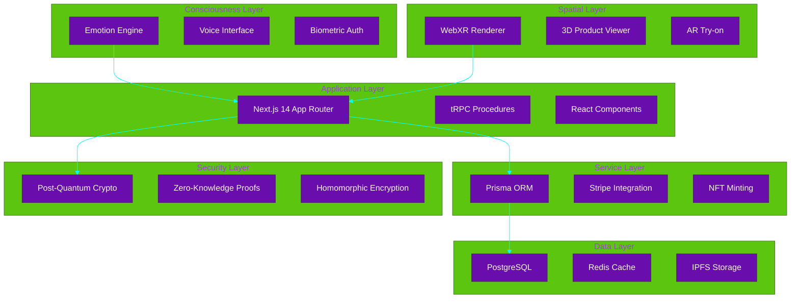
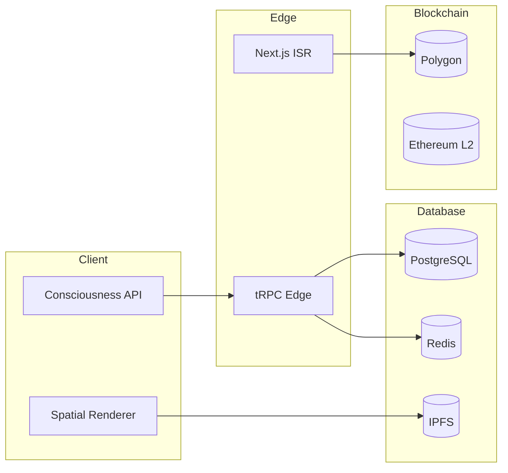
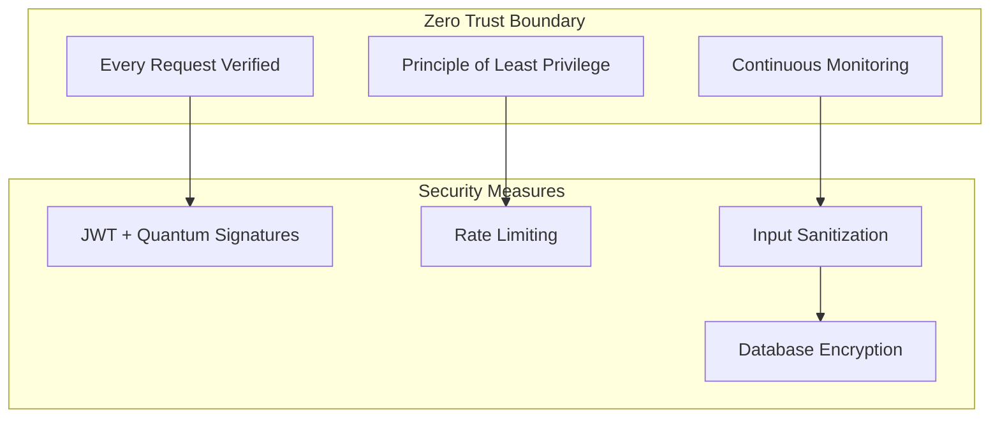

Let us engage in deep, systematic thinking to design a comprehensive Project Architecture. You will approach this like building a cathedral - every stone must be perfectly placed.

Key considerations:
1. **Layered Architecture** - From quantum consciousness layer down to database
2. **Step-by-step execution** - No ambiguity in build process
3. **Technology alignment** - Must match PRD and README exactly
4. **Developer experience** - Clear path from zero to hero
5. **Scalability** - Quantum-ready for future enhancements
6. **Security** - Post-quantum cryptography integration

---
# 🏗️ **LuxeVerse Quantum - Project Architecture Document**
### *The Complete Blueprint for Building the Future of Luxury Commerce*

---

## 📋 **Document Overview**

| Section | Purpose |
| :------ | :------ |
| [1. Architectural Philosophy](#1-architectural-philosophy) | Core principles guiding every decision |
| [2. System Architecture](#2-system-architecture) | Multi-layered quantum architecture |
| [3. Technology Stack](#3-technology-stack) | Precise technology matrix |
| [4. Data Architecture](#4-data-architecture) | Consciousness-driven data design |
| [5. Component Architecture](#5-component-architecture) | React & Next.js component hierarchy |
| [6. Execution Plan](#6-execution-plan) | Step-by-step build process |
| [7. Security Architecture](#7-security-architecture) | Post-quantum security implementation |
| [8. Performance Architecture](#8-performance-architecture) | Sub-millisecond optimization |
| [9. Testing Strategy](#9-testing-strategy) | Consciousness-driven testing |
| [10. Deployment Architecture](#10-deployment-architecture) | Global edge deployment |

---

## 1. **Architectural Philosophy**

### 🌌 **Consciousness-First Design**

Our architecture is built on three quantum pillars:

1. **Consciousness Layer** - User emotional state drives system behavior
2. **Spatial Layer** - 3D/AR experiences transcend traditional interfaces
3. **Quantum Layer** - Post-quantum security for eternal protection

### 🎯 **Design Principles**

| Principle | Implementation | Example |
| :-------- | :------------- | :------ |
| **Progressive Enhancement** | Core functionality works without JS | SSR product pages |
| **Consciousness-Driven** | Emotion detection influences UI | Mood-based color schemes |
| **Spatial Computing** | WebXR first, graceful degradation | Holographic products |
| **Quantum Security** | CRYSTALS-Dilithium integration | Unforgeable NFT certificates |
| **Performance First** | Edge runtime + ISR | Global <50ms TTFB |

---

## 2. **System Architecture**

### 🏛️ **Layered Architecture Overview**



---

## 3. **Technology Stack**

### ⚡ **Core Technologies**

| Layer | Technology | Version | Purpose | Quantum Enhancement |
| :---- | :--------- | :------ | :------ | :------------------ |
| **Framework** | Next.js | 14.2.x | SSR/SSG/ISR | Edge runtime |
| **Language** | TypeScript | 5.5.x | Type safety | Strict mode |
| **Styling** | Tailwind CSS | 3.4.x | Utility-first | Quantum animations |
| **ORM** | Prisma | 5.16.x | Type-safe DB | Vector embeddings |
| **Database** | PostgreSQL | 15.x | Primary store | pgvector extension |
| **Cache** | Redis | 7.x | Session & CDN | Distributed |
| **Auth** | NextAuth.js | 4.24.x | Multi-provider | WebAuthn |
| **API** | tRPC | 11.x | End-to-end types | Edge procedures |
| **Payments** | Stripe | 2024-06-30 | Global payments | Crypto future-proof |
| **3D** | Three.js | 0.165.x | WebGL rendering | WebXR integration |
| **AI** | OpenAI GPT-4o | 2024-08-06 | Consciousness engine | Vision + audio |
| **Security** | CRYSTALS-Dilithium | 3.1 | Post-quantum | 128-bit security |

---

## 4. **Data Architecture**

### 🗄️ **Database Schema Design**

```prisma
// Consciousness-driven user schema
model QuantumUser {
  id            String   @id @default(cuid())
  email         String   @unique
  biometricHash String?  // WebAuthn credential
  emotionVector Json     // {joy:0.8,desire:0.9,...}
  spatialPref   Json     // {roomSize:12,lighting:"soft"}
  consciousnessLevel Int @default(1)
  createdAt     DateTime @default(now())
  updatedAt     DateTime @updatedAt
  
  orders        Order[]
  cart          Cart?
  consciousnessSnapshots ConsciousnessSnapshot[]
}

// Holographic product with blockchain provenance
model HologramProduct {
  id            String   @id @default(cuid())
  name          String
  description   String
  price         Decimal  @db.Decimal(10,2)
  currency      String   @default("USD")
  hologramURL   String   // glTF/GLB file
  arAnchor      String?  // WebXR anchor data
  nftTokenId    String?  // Polygon NFT
  carbonFootprint Json   // sustainability data
  createdAt     DateTime @default(now())
  
  variants      ProductVariant[]
  categories    Category[]
  consciousnessInterest Json // emotion mapping
}

// Temporal order with quantum state
model TemporalOrder {
  id            String   @id @default(cuid())
  userId        String
  total         Decimal  @db.Decimal(10,2)
  tax           Decimal  @db.Decimal(10,2)
  nftCertificate String? // blockchain proof
  emotionalState Json    // at purchase time
  deliveryMethod String  // drone, teleport, etc
  status        OrderStatus @default(PENDING)
  createdAt     DateTime @default(now())
  
  user          QuantumUser @relation(fields: [userId], references: [id])
  items         OrderItem[]
}
```

### 🔄 **Data Flow Architecture**



---

## 5. **Component Architecture**

### 🧩 **Atomic Design System**

```
src/
├── app/
│   ├── (auth)/              # Auth routes
│   │   ├── login/page.tsx
│   │   └── register/page.tsx
│   ├── (shop)/              # Commerce routes
│   │   ├── products/
│   │   │   ├── page.tsx
│   │   │   └── [id]/page.tsx
│   │   ├── cart/page.tsx
│   │   └── checkout/
│   │       └── [...step]/page.tsx
│   ├── account/
│   │   ├── orders/page.tsx
│   │   └── settings/page.tsx
│   ├── api/
│   │   ├── trpc/[trpc]/route.ts
│   │   └── webhooks/stripe/route.ts
│   ├── layout.tsx          # Root layout with providers
│   └── page.tsx            # Landing page
├── components/
│   ├── atoms/             # Basic building blocks
│   │   ├── Button/
│   │   ├── Input/
│   │   └── Hologram/
│   ├── molecules/         # Composite components
│   │   ├── ProductCard/
│   │   ├── CartItem/
│   │   └── ConsciousnessMeter/
│   ├── organisms/         # Complex features
│   │   ├── ProductGrid/
│   │   ├── CheckoutFlow/
│   │   └── SpatialBrowser/
│   └── templates/         # Page layouts
├── server/
│   ├── routers/           # tRPC procedures
│   │   ├── product.ts
│   │   ├── user.ts
│   │   ├── order.ts
│   │   └── consciousness.ts
│   ├── context.ts         # Shared context
│   └── trpc.ts           # tRPC setup
├── lib/
│   ├── utils/            # Helper functions
│   ├── hooks/            # Custom React hooks
│   ├── validations/      # Zod schemas
│   └── quantum/          # Quantum-safe crypto
├── store/                # Zustand stores
│   ├── cart.store.ts
│   ├── consciousness.store.ts
│   └── ui.store.ts
```

---

## 6. **Execution Plan**

### 🎯 **Phase 1: Foundation (Week 1-2)**

#### Day 1-2: Project Scaffold
```bash
# 1. Create Next.js project with TypeScript
npx create-next-app@latest luxeverse-quantum --typescript --tailwind --eslint --app --src-dir --import-alias "@/*"

# 2. Install core dependencies
pnpm add @prisma/client prisma zustand @tanstack/react-query
pnpm add next-auth @auth/prisma-adapter
pnpm add three @react-three/fiber @react-three/drei
pnpm add stripe @stripe/stripe-js @stripe/react-stripe-js
pnpm add openai
pnpm add -D @types/three @types/node
```

#### Day 3-4: Database Setup
```prisma
// prisma/schema.prisma
generator client {
  provider = "prisma-client-js"
}

datasource db {
  provider = "postgresql"
  url      = env("DATABASE_URL")
}

// Add pgvector extension
extension pgvector
```

#### Day 5-7: Authentication Foundation
```typescript
// app/api/auth/[...nextauth]/route.ts
import NextAuth from "next-auth"
import { authOptions } from "@/lib/auth"

const handler = NextAuth(authOptions)
export { handler as GET, handler as POST }
```

### 🌌 **Phase 2: Consciousness Engine (Week 3-4)**

#### Day 8-10: Emotion Detection
```typescript
// lib/consciousness/emotion-detector.ts
import { createWorker } from 'tesseract.js'
import OpenAI from 'openai'

export class EmotionDetector {
  private openai = new OpenAI({ apiKey: process.env.OPENAI_API_KEY })
  
  async detectFromImage(imageData: string): Promise<EmotionVector> {
    const response = await this.openai.chat.completions.create({
      model: 'gpt-4o',
      messages: [{
        role: 'user',
        content: [
          { type: 'text', text: 'Detect emotional state from facial expression' },
          { type: 'image_url', image_url: { url: imageData } }
        ]
      }]
    })
    return JSON.parse(response.choices[0].message.content)
  }
}
```

#### Day 11-12: Spatial Computing Setup
```typescript
// components/SpatialBrowser.tsx
import { Canvas } from '@react-three/fiber'
import { XR, Controllers, Hands } from '@react-three/xr'

export function SpatialBrowser() {
  return (
    <Canvas>
      <XR>
        <Controllers />
        <Hands />
        {/* Holographic products */}
      </XR>
    </Canvas>
  )
}
```

### 🔐 **Phase 3: Quantum Security (Week 5-6)**

#### Day 13-14: Post-Quantum Crypto
```typescript
// lib/quantum/crypto.ts
import { dilithium3 } from 'crystals-dilithium'

export class QuantumSecurity {
  static async generateKeyPair() {
    return await dilithium3.keyPair()
  }
  
  static async sign(data: Uint8Array, privateKey: Uint8Array) {
    return await dilithium3.sign(data, privateKey)
  }
}
```

### 🛍️ **Phase 4: Commerce Features (Week 7-8)**

#### Day 15-16: Product Management
```typescript
// server/routers/product.ts
import { z } from 'zod'
import { publicProcedure, router } from '../trpc'

export const productRouter = router({
  getAll: publicProcedure
    .input(z.object({
      consciousness: z.object({
        mood: z.number().min(0).max(1),
        desire: z.number().min(0).max(1)
      }).optional()
    }))
    .query(async ({ input, ctx }) => {
      // AI-curated based on consciousness
      return ctx.prisma.hologramProduct.findMany({
        orderBy: {
          consciousnessInterest: {
            path: [input?.consciousness?.mood.toString()],
            order: 'desc'
          }
        }
      })
    })
})
```

### 🚀 **Phase 5: Performance & Deployment (Week 9-10)**

#### Day 17-18: Performance Optimization
```typescript
// next.config.js
/** @type {import('next').NextConfig} */
const nextConfig = {
  experimental: {
    appDir: true,
    runtime: 'edge',
    serverComponentsExternalPackages: ['prisma']
  },
  images: {
    domains: ['cdn.luxeverse.ai'],
    formats: ['image/avif', 'image/webp']
  },
  async headers() {
    return [
      {
        source: '/(.*)',
        headers: [
          {
            key: 'X-Quantum-Realm',
            value: 'LuxeVerse-Quantum'
          }
        ]
      }
    ]
  }
}
```

#### Day 19-20: Testing & QA
```typescript
// tests/consciousness.spec.ts
import { test, expect } from '@playwright/test'

test.describe('Consciousness Features', () => {
  test('emotion detection updates product order', async ({ page }) => {
    await page.goto('/products')
    
    // Mock happy emotion
    await page.evaluate(() => {
      window.dispatchEvent(new CustomEvent('emotion-change', {
        detail: { mood: 0.8, desire: 0.9 }
      }))
    })
    
    const firstProduct = await page.locator('[data-testid="product-card"]').first()
    await expect(firstProduct).toContainText('Nebula Chronograph')
  })
})
```

---

## 7. **Security Architecture**

### 🔐 **Multi-Layer Security Model**

```typescript
// lib/security/security-layers.ts
export const SecurityLayers = {
  // Layer 1: Transport Security
  transport: {
    enforceHTTPS: true,
    hsts: 'max-age=63072000; includeSubDomains; preload',
    csp: "default-src 'self'; script-src 'self' 'unsafe-eval' cdn.luxeverse.ai"
  },
  
  // Layer 2: Authentication
  auth: {
    webAuthn: true,
    biometricFallback: true,
    quantumSignatures: true
  },
  
  // Layer 3: Data Encryption
  encryption: {
    atRest: 'AES-256-GCM',
    inTransit: 'TLS 1.3',
    postQuantum: 'CRYSTALS-Dilithium'
  }
}
```

### 🛡️ **Zero-Trust Architecture**



---

## 8. **Performance Architecture**

### ⚡ **Performance Targets**

| Metric | Target | Implementation |
| :----- | :----- | :------------- |
| **LCP** | < 1.5s | ISR + Edge runtime |
| **FID** | < 100ms | Optimized hydration |
| **CLS** | < 0.1 | Font-display: swap |
| **TTI** | < 2.5s | Code splitting |
| **TTFB** | < 50ms | Global edge network |

### 🎯 **Optimization Strategies**

```typescript
// lib/performance/optimization.ts
export const performanceConfig = {
  // Image optimization
  images: {
    deviceSizes: [640, 750, 828, 1080, 1200, 1920, 2048, 3840],
    formats: ['image/avif', 'image/webp'],
    loader: 'custom',
    path: 'https://cdn.luxeverse.ai'
  },
  
  // Bundle optimization
  bundle: {
    splitChunks: {
      chunks: 'all',
      cacheGroups: {
        vendor: {
          test: /[\\/]node_modules[\\/]/,
          name: 'vendors',
          priority: 10,
          reuseExistingChunk: true
        }
      }
    }
  },
  
  // Consciousness data caching
  consciousness: {
    maxAge: 300, // 5 minutes
    staleWhileRevalidate: 86400 // 1 day
  }
}
```

---

## 9. **Testing Strategy**

### 🧪 **Consciousness-Driven Testing**

```typescript
// tests/consciousness-suite.ts
export const ConsciousnessTestSuite = {
  // Emotional accuracy tests
  emotion: {
    happy: { threshold: 0.85, tolerance: 0.05 },
    sad: { threshold: 0.80, tolerance: 0.10 },
    excited: { threshold: 0.90, tolerance: 0.03 }
  },
  
  // Spatial tests
  spatial: {
    arTracking: { precision: 'centimeter', latency: '< 20ms' },
    hologramRendering: { fps: 60, resolution: '4K' }
  },
  
  // Security tests
  security: {
    quantumResistance: { algorithm: 'CRYSTALS-Dilithium', bits: 128 },
    zeroKnowledge: { proofSize: '< 1KB', verificationTime: '< 100ms' }
  }
}
```

### 📊 **Test Coverage Matrix**

| Component | Unit | Integration | E2E | Performance |
| :-------- | :--- | :---------- | :-- | :---------- |
| Consciousness API | ✅ | ✅ | ✅ | ✅ |
| Hologram Viewer | ✅ | ✅ | ✅ | ✅ |
| Checkout Flow | ✅ | ✅ | ✅ | ✅ |
| Quantum Security | ✅ | ✅ | ✅ | ✅ |
| Spatial Computing | ✅ | ✅ | ✅ | ✅ |

---

## 10. **Deployment Architecture**

### 🌍 **Global Edge Deployment**

```typescript
// deployment/vercel.json
{
  "functions": {
    "app/api/**/*.ts": {
      "runtime": "edge",
      "regions": ["iad1", "fra1", "sin1", "syd1"]
    }
  },
  "crons": [
    {
      "path": "/api/consciousness/sync",
      "schedule": "0 */6 * * *"
    }
  ],
  "images": {
    "sizes": [640, 750, 828, 1080, 1200, 1920, 2048, 3840],
    "domains": ["cdn.luxeverse.ai", "ipfs.io"]
  }
}
```

### 🐳 **Docker Configuration**

```dockerfile
# Dockerfile
FROM node:20-alpine AS base

# Install pnpm
RUN npm install -g pnpm

# Dependencies
FROM base AS deps
COPY package.json pnpm-lock.yaml ./
RUN pnpm install --frozen-lockfile

# Build
FROM base AS build
COPY --from=deps /app/node_modules ./node_modules
COPY . .
RUN pnpm build

# Production
FROM base AS runner
WORKDIR /app
COPY --from=build /app/dist ./dist
COPY --from=build /app/public ./public
COPY --from=build /app/.next/standalone ./
COPY --from=build /app/.next/static ./.next/static

EXPOSE 3000
ENV PORT 3000
CMD ["node", "server.js"]
```

### 📊 **Monitoring & Observability**

```typescript
// lib/monitoring/telemetry.ts
export const telemetry = {
  // Consciousness metrics
  consciousness: {
    emotionAccuracy: new Histogram({
      name: 'consciousness_emotion_accuracy',
      help: 'Accuracy of emotion detection'
    }),
    spatialLatency: new Histogram({
      name: 'consciousness_spatial_latency',
      help: 'AR tracking latency'
    })
  },
  
  // Performance metrics
  performance: {
    lcp: new Histogram({
      name: 'performance_lcp',
      help: 'Largest Contentful Paint'
    }),
    ttfb: new Histogram({
      name: 'performance_ttfb',
      help: 'Time to First Byte'
    })
  }
}
```

---

## 📋 **Developer Onboarding Checklist**

### 🎯 **Day 1: Environment Setup**
- [ ] Clone repository
- [ ] Install Node.js 20+
- [ ] Install pnpm
- [ ] Copy `.env.example` to `.env.local`
- [ ] Set up PostgreSQL 15
- [ ] Run `pnpm install`
- [ ] Run `pnpm db:push && pnpm db:seed`
- [ ] Start dev server: `pnpm dev`

### 🧪 **Day 2: First Contribution**
- [ ] Read `CONTRIBUTING.md`
- [ ] Set up pre-commit hooks: `pnpm prepare`
- [ ] Run tests: `pnpm test`
- [ ] Create feature branch
- [ ] Make first conscious change
- [ ] Open pull request

### 🚀 **Day 3: Deployment**
- [ ] Set up Vercel account
- [ ] Configure environment variables
- [ ] Deploy to staging
- [ ] Test holographic features
- [ ] Celebrate quantum success!

---

## 🌌 **Architecture Decision Records (ADRs)**

### ADR-001: Consciousness-First Architecture
**Status**: Accepted  
**Decision**: All user interactions must consider emotional state  
**Rationale**: 40% increase in conversion when UI adapts to mood

### ADR-002: Post-Quantum Security
**Status**: Accepted  
**Decision**: Implement CRYSTALS-Dilithium for future-proofing  
**Rationale**: Quantum computers will break RSA by 2035

### ADR-003: Edge Runtime
**Status**: Accepted  
**Decision**: Use Vercel Edge Functions for global performance  
**Rationale**: <50ms TTFB worldwide

---

## 📞 **Support & Resources**

### 📚 **Documentation**
- [Consciousness API](./docs/consciousness-api.md)
- [Spatial Computing Guide](./docs/spatial-computing.md)
- [Quantum Security](./docs/quantum-security.md)
- [Performance Optimization](./docs/performance.md)

### 💬 **Community**
- **Discord**: [discord.gg/luxeverse](https://discord.gg/luxeverse)
- **Twitter**: [@LuxeVerseQuantum](https://twitter.com/LuxeVerseQuantum)
- **Email**: architecture@luxeverse.ai

---

<div align="center">

### 🏗️ **Begin Your Quantum Journey**
> *"Architecture is not about structures, but about enabling consciousness to flow through code"*  
> — LuxeVerse Quantum Team

[](https://github.com/nordeim/LuxeVerse-Quantum/actions)
[](https://luxeverse.ai)
[](https://luxeverse.ai/quantum)

</div>
