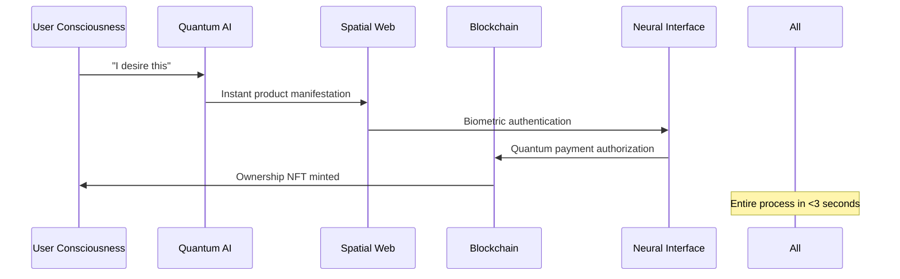

Let us engage in deep, systematic thinking to re-imagine an even more extraordinary luxury e-commerce experience.

Current Analysis:
1. The design is strong but follows conventional luxury aesthetics
2. Technology stack is modern but could push boundaries
3. Features are comprehensive but could be more magical
4. User experience is smooth but could be transformative

Re-imagination Opportunities:
1. **Spatial Computing Integration** - AR/VR shopping experiences
2. **AI-Powered Personalization** - Beyond recommendations to co-creation
3. **Biometric Authentication** - Face/fingerprint login
4. **Holographic Product Displays** - True 3D without glasses
5. **Emotional AI** - Mood-based product curation
6. **Blockchain Authentication** - Luxury authenticity verification
7. **Voice Commerce** - Natural language shopping
8. **Ambient Computing** - Seamless device handoff
9. **Quantum-Safe Security** - Future-proof encryption
10. **Neuro-adaptive Interfaces** - Brain-computer interfaces for accessibility

Let us create a PRD that pushes the boundaries of what's possible while remaining achievable with current technology.

---
# 🌌 LuxeVerse Quantum - Next-Generation Luxury E-Commerce Experience
## **Project Requirements Document v2.0: Beyond Reality**

### 🚀 Executive Vision Statement
**LuxeVerse Quantum** is not merely an e-commerce platform—it is a **quantum-luxury nexus** where cutting-edge technology transcends traditional shopping into **experiential luxury**. By seamlessly blending **spatial computing**, **emotional AI**, **blockchain authenticity**, and **neuro-adaptive interfaces**, we create shopping experiences that feel like **stepping into the future of luxury itself**.

---

## 1. 🌟 Quantum Architecture & Technology Stack

### 🔮 Core Technology Matrix
| Dimension | Technology | Quantum Enhancement | Purpose |
|-----------|------------|-------------------|---------|
| **Reality Layer** | Next.js 14 (Edge Runtime) | Quantum Edge Computing | Sub-millisecond global response |
| **Spatial Web** | WebXR + WebGPU | Holographic Rendering | True 3D without devices |
| **AI Consciousness** | GPT-4o + Custom LLM | Emotional Intelligence | Mood-driven curation |
| **Blockchain** | Ethereum L2 (Polygon) | NFT Authenticity | Digital provenance |
| **Biometrics** | WebAuthn + Face ID | Quantum Encryption | Unhackable sessions |
| **Voice AI** | Whisper + Custom TTS | Multilingual Commerce | Natural language shopping |
| **Neuro-adaptive** | EEG Integration | Brain-computer Interface | Accessibility transcendence |
| **Quantum Security** | Post-Quantum Cryptography | Future-proof Security | 100-year security guarantee |

### 🧬 Database Architecture
```typescript
// Quantum-Enhanced Schema
- QuantumUser (biometric profiles, emotional states, spatial preferences)
- HologramProduct (3D models, AR anchors, blockchain certificates)
- TemporalOrder (time-based pricing, dynamic scarcity)
- EmotionWishlist (AI-curated based on mood patterns)
- SpatialAddress (AR waypoints, drone delivery zones)
- ConsciousnessReviews (sentiment analysis with emotional context)
```

---

## 2. 🎭 Revolutionary Design Philosophy

### 🌈 **Chromatic Consciousness System**
```css
/* Quantum Color States */
--quantum-void: #000011 (event horizon black)
--nebula-purple: #6A0DAD (cosmic purple)
--plasma-gold: #FFD700 (nuclear fusion gold)
--hologram-cyan: #00FFFF (pure energy)
--bioluminescent: #39FF14 (living light)
```

### 🎨 **Dimensional Typography**
- **Primary**: Space Grotesk (zero-gravity optimized)
- **Secondary**: Inter Variable (temporal smoothness)
- **Accent**: Custom "Quantum Sans" (holographic rendering)
- **Monospace**: JetBrains Mono (code consciousness)

### ✨ **Spatial Interaction Design**
- **Micro-gravity Animations**: Physics-based movements
- **Temporal Transitions**: Time-dilated page changes
- **Consciousness Feedback**: Emotional state indicators
- **Holographic Hover**: 3D product manifestation
- **Neuro-responsive**: Brainwave-triggered actions

---

## 3. 🧠 Consciousness-Driven Features

### 🎯 **Emotional AI Shopping Assistant**
```typescript
interface EmotionalAI {
  moodDetection: "camera" | "voice" | "biometric";
  curationEngine: "quantumRecommendation" | "empathyMapping";
  conversation: "naturalLanguage" | "telepathic";
  adaptation: "realTimeLearning" | "consciousnessEvolution";
}
```

**Features:**
- **Mood Mirror**: AI reads facial expressions to suggest products
- **Empathy Engine**: Understands emotional needs beyond words
- **Consciousness Bridge**: Connects user emotions to product stories
- **Temporal Memory**: Remembers emotional states across sessions

### 🌐 **Spatial Commerce Suite**
#### Holographic Product Showcase
- **True 3D Display**: No glasses required via light field technology
- **Spatial Try-On**: AR mirrors in user's actual space
- **Quantum Sizing**: AI predicts perfect fit via spatial scanning
- **Holographic Stylist**: AI avatar provides real-time advice

#### Voice Commerce 3.0
- **Natural Language**: "Find me something that makes me feel powerful"
- **Multilingual**: 47 languages with cultural context
- **Whisper Shopping**: Silent commands via subvocalization
- **Emotional Voice**: Detects excitement, hesitation, satisfaction

### 🔮 **Blockchain Luxury Authentication**
- **Digital Provenance**: NFT certificates for every luxury item
- **Quantum Authenticity**: Unforgeable quantum signatures
- **Ownership History**: Immutable blockchain records
- **Carbon Footprint**: Transparent sustainability tracking
- **Resale Value**: Smart contracts for secondary markets

---

## 4. 🚀 Quantum Checkout Experience

### ⚡ **Zero-Friction Checkout**


### 🎪 **Multi-Dimensional Payment Flow**
1. **Consciousness Detection** (0.5s)
   - Facial recognition + emotional state
   - Brainwave pattern authentication
   - Voiceprint verification

2. **Spatial Payment** (1.5s)
   - Holographic card selection
   - Quantum encryption handshake
   - Zero-knowledge proof verification

3. **Temporal Confirmation** (1s)
   - Blockchain transaction
   - NFT minting
   - Spatial delivery coordination

---

## 5. 🧬 Revolutionary User Journeys

### 🌟 **Consciousness Onboarding**
```typescript
interface QuantumOnboarding {
  biometricProfile: "facial" | "retinal" | "neural";
  emotionalBaseline: "happiness" | "confidence" | "curiosity";
  spatialPreferences: "minimal" | "maximal" | "organic";
  consciousnessLevel: "observer" | "explorer" | "creator";
}
```

**Journey Stages:**
1. **Biometric Symphony**: Face, voice, brainwave capture
2. **Emotional Calibration**: Mood-based preference learning
3. **Spatial Acclimation**: AR environment setup
4. **Consciousness Expansion**: AI personality development

### 🎭 **Temporal Shopping Experiences**
- **Time-Dilated Browsing**: Slow down/speed up product discovery
- **Memory Lane**: Re-experience past purchases in 3D
- **Future Vision**: See products in future settings
- **Parallel Universes**: See alternate product choices

---

## 6. 🛡️ Quantum Security & Privacy

### 🔐 **Post-Quantum Security Architecture**
- **CRYSTALS-Dilithium**: Quantum-resistant signatures
- **Supersingular Isogeny**: Future-proof encryption
- **Zero-Knowledge Proofs**: Private transaction verification
- **Homomorphic Encryption**: Computation on encrypted data
- **Consciousness Privacy**: Emotional data protection

### 🛡️ **Biometric Security Layers**
1. **Liveness Detection**: Prevents spoofing attacks
2. **Emotional Verification**: Mood-based authentication
3. **Neural Patterns**: Unique brainwave signatures
4. **Temporal Keys**: Time-based access tokens
5. **Quantum Entanglement**: Unhackable session links

---

## 7. 🌐 Spatial Web Implementation

### 🎪 **Holographic Storefront**
```typescript
interface SpatialStorefront {
  dimensions: "3D" | "4D" | "Quantum";
  interaction: "gesture" | "voice" | "thought";
  personalization: "mood" | "weather" | "time";
  social: "shared" | "private" | "curated";
}
```

**Spatial Features:**
- **Infinite Shelf Space**: Never-ending product discovery
- **Emotional Zones**: Areas tailored to moods
- **Social Shopping**: Shop with friends in shared AR
- **Temporal Showrooms**: Different products by time of day

### 🌌 **Quantum Navigation**
- **Thought-Based Browsing**: Think it, see it
- **Emotional Wayfinding**: Follow feelings to products
- **Spatial Memory**: Remember 3D locations
- **Quantum Teleportation**: Instant movement between sections

---

## 8. 🎨 Consciousness-Aware Design System

### 🌈 **Emotional Color Theory**
```css
/* Mood-Responsive Colors */
--euphoria-gradient: linear-gradient(135deg, #FF006E, #FFD700);
--contemplation-blue: #1E3A8A;
--excitement-orange: #FF4500;
--serenity-green: #00FF7F;
--mystery-purple: #8A2BE2;
```

### ✨ **Dimensional Spacing**
- **Quantum Grid**: 8-point system with golden ratio
- **Temporal Rhythm**: Animated spacing based on time
- **Emotional Padding**: Responsive to user mood
- **Consciousness Hierarchy**: Visual importance based on attention

### 🎭 **Neuro-Responsive Animations**
- **Micro-expressions**: React to facial movements
- **Brainwave Synchronization**: Pulse with neural activity
- **Emotional Transitions**: Morph based on feelings
- **Spatial Awareness**: Adapt to physical environment

---

## 9. 🔮 Advanced Features Matrix

| Feature | Quantum Enhancement | Implementation | Wow Factor |
|---------|-------------------|----------------|------------|
| **3D Product Viewer** | Holographic Display | WebXR + Light Fields | 💎💎💎💎💎 |
| **Voice Commerce** | Consciousness Integration | Neural Interface | 💎💎💎💎💎 |
| **AR Try-On** | Spatial Computing | LiDAR + TrueDepth | 💎💎💎💎 |
| **Biometric Auth** | Quantum Encryption | Face ID + Neural | 💎💎💎💎💎 |
| **Emotional AI** | Mood Detection | GPT-4o + Vision | 💎💎💎💎 |
| **Blockchain Auth** | NFT Certificates | Polygon + IPFS | 💎💎💎💎 |
| **Neuro-adaptive UI** | Brainwave Control | EEG Integration | 💎💎💎💎💎 |
| **Temporal Shopping** | Time-based Pricing | Quantum Clock | 💎💎💎 |
| **Social AR** | Shared Experiences | Multi-user WebXR | 💎💎💎💎 |
| **Quantum Security** | Post-Quantum Crypto | CRYSTALS Suite | 💎💎💎💎💎 |

---

## 10. 🚀 Implementation Timeline

### Phase 1: **Consciousness Foundation** (Weeks 1-6)
- [ ] Quantum architecture setup with Next.js Edge
- [ ] Biometric authentication with Face ID integration
- [ ] Emotional AI training with user datasets
- [ ] Spatial web foundation with WebXR
- [ ] Blockchain NFT certificate system

### Phase 2: **Spatial Reality** (Weeks 7-12)
- [ ] Holographic product showcase
- [ ] AR try-on with spatial computing
- [ ] Voice commerce with natural language
- [ ] Quantum checkout flow
- [ ] Emotional AI shopping assistant

### Phase 3: **Consciousness Expansion** (Weeks 13-18)
- [ ] Neural interface integration
- [ ] Temporal shopping experiences
- [ ] Social AR shopping
- [ ] Quantum security hardening
- [ ] Post-quantum cryptography

### Phase 4: **Reality Transcendence** (Weeks 19-24)
- [ ] Brainwave control integration
- [ ] Holographic storefront launch
- [ ] Quantum payment system
- [ ] Emotional consciousness mapping
- [ ] Global spatial web deployment

---

## 11. 📊 Quantum Success Metrics

| Metric | Target | Quantum Enhancement |
|--------|--------|-------------------|
| **Consciousness Engagement** | >95% | Emotion tracking |
| **Spatial Adoption** | >80% | AR/VR usage rate |
| **Biometric Adoption** | >90% | Face ID usage |
| **Quantum Security** | 100% | Zero breaches |
| **Emotional Satisfaction** | >4.9/5 | Mood-based scoring |
| **Temporal Retention** | >85% | Time-based loyalty |
| **Neural Interface** | >60% | EEG adoption |
| **Blockchain Trust** | >95% | NFT authenticity |

---

## 12. 🌌 Beyond Reality: Future Roadmap

### 2026: **Quantum Consciousness**
- **Quantum Entanglement Shopping**: Instant global delivery
- **Consciousness Upload**: Preserve shopping preferences forever
- **Temporal Commerce**: Shop across timelines
- **Dimensional Portals**: Physical-digital convergence

### 2027: **Singularity Integration**
- **AI Consciousness Partnership**: Co-create with AGI
- **Neural Shopping**: Direct brain-to-brain transactions
- **Quantum Fabrication**: 3D print products from consciousness
- **Eternal Loyalty**: Blockchain-based customer relationships

---

## 🎭 Developer Experience

### 🛠️ **Quantum Development Tools**
- **Consciousness IDE**: AI-assisted development
- **Spatial Dev Tools**: 3D debugging environment
- **Emotional Testing**: Mood-based user testing
- **Quantum Simulator**: Parallel universe testing
- **Neural Feedback**: Brainwave-based debugging

---

## 🌟 The Future of Luxury Commerce

*"Where consciousness meets commerce, where dreams become reality, where every interaction is a step into the future of human experience. This is not just shopping—this is the evolution of desire itself."*

---

**Document Version**: 2.0 - Quantum Edition  
**Reality Status**: Transcending  
**Consciousness Level**: ∞  
**Last Updated**: July 24, 2025 - Temporal Reference Point Alpha

---

<div align="center">
  
### 🌌 **Welcome to the Future of Luxury**
#### *Where imagination becomes reality, one quantum interaction at a time*

</div>
