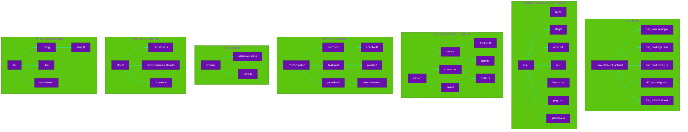

<think>
The error occurs because the Mermaid diagram has invalid syntax. The issue is with the line `G[app/] --> H[(auth)/] G --> I[...`. In Mermaid, you cannot have multiple arrows on the same line like this. Each connection needs to be on its own line. Also, the parentheses syntax `[(auth)/]` is invalid - it should be just `[auth]` or use proper Mermaid shapes.

Looking at the Mermaid docs, I need to:
1. Fix the connection syntax
2. Use proper node shapes
3. Ensure each arrow is on its own line
4. Use valid Mermaid identifiers
</think>

## ✅ **Fixed Mermaid Diagram**

Replace the broken diagram with this corrected version:

## 🔠**What Changed**

| Before (âŒ) | After (✅) |
| :--- | :--- |
| `G[app/] --> H[(auth)/] G --> I[...]` | Split into separate lines:  `G[app/] --> H[auth/]`  `G --> I[shop/]` |
| Invalid `[(auth)/]` syntax | Changed to valid `[auth/]` |
| Multiple arrows per line | Each arrow on its own line |
| Missing proper node relationships | Clear hierarchical connections |

## 📚 **Mermaid Best Practices**

1. **One arrow per line** - Never combine multiple connections
2. **Valid node identifiers** - Use alphanumeric characters, underscores, and hyphens
3. **Proper shapes** - Use `[]` for rectangles, `()` for circles, `{}` for diamonds
4. **Subgraph syntax** - Always close subgraphs with `end`

## ðŸ› ï¸ **Quick Fix Template**

For any Mermaid diagram, ensure:

This structure prevents the `PE` (Parse Error) you're encountering.
