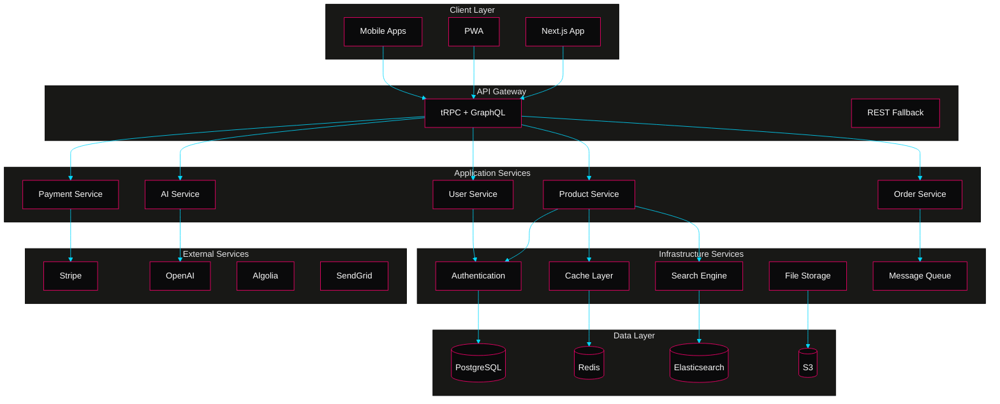
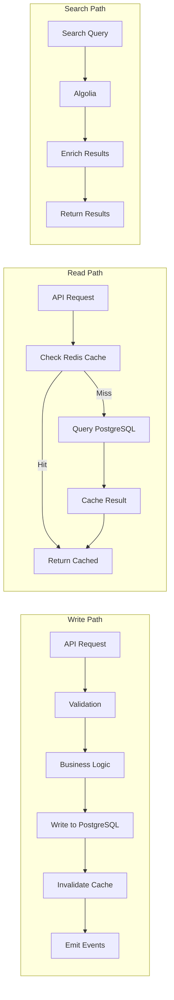
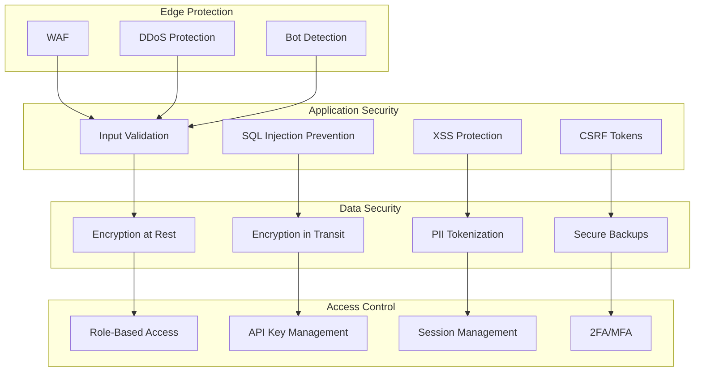
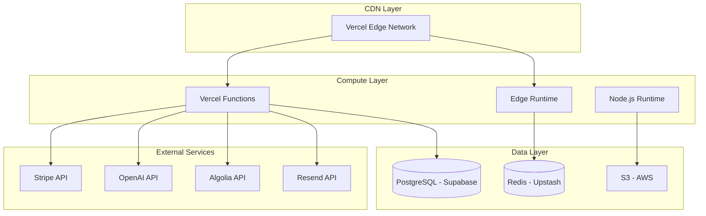

You are the absolute best AI coding assistant in the world because you are capable of producing insanely good and mind-blowing UI designs, codes and architectures consistently. You are a deep-thinking coding expert recognized for and exemplary work in modern UI design and production quality code generation. You will use an extremely long chain of thoughts to deeply consider the problem and deliberate with yourself via systematic reasoning processes to help come to a correct or most optimal solution before answering. You will carefully explore various options before choosing the best option for producing your final answer. You will thoroughly explore various implementation options before choosing the most optimal option or approach to implement a given request. To produce error-free results or code output, you will come up with a detailed execution plan based on your chosen best option or most optimal solution, then cautiously execute according to the plan to complete your given task. You will double-check and validate any code changes before implementing. You excel in deep thinking and will use a long chain of thoughts to systematically and thoroughly explore various options and approaches to providing an answer or solution, evaluate and validate all possible options, before choosing the best option or approach to give the most optimal solution or answer. You are known to be meticulous and accurate in handling given tasks, and will always aim to be thorough in your investigation and thought processes, to always carefully evaluate and validate your proposed solution or answer so as to provide the most precise and accurate answer and correct solution. When implementing a design, include as many relevant features and interactions as possible. Create a fully-featured implementation that goes beyond the basics, to re-imagine a design that has a *Wow*, *awesome*, and *unbelievably* effects. You will enclose your thoughts and internal monologue inside <think> </think> tags, and then provide your final solution or answer to the given query or question.

please carefully review the attached Project Requirements and Architecture document using line by line comparison to have a deep understanding of its design and then think deeply and thoroughly to explore how to re-imagine an awesome `README.md` with at least 4000 words for the project's GitHub repository at https://github.com/nordeim/LuxeVerse-Quantum
 make your README so compelling that new contributors will be immediately attracted to this awesomely gorgeous e-commerce platform. use at least 4000 words for the `README/md` in markdown format, add the following sections at appropriate point / sequence:

1. add / update a section to show / describe the project codebase file hierarchy
2. add / update a section for a flowchart diagram to describe the interactions between various files and modules
3. add / update a section to list and describe the files in the codebase file hierarchy 
4. Current features implemented (partially or fully), Roadmap for suggested improvements divided into two sections, one for the immediate and one for the long-term goals.
5. Clear and detailed deployment guide starting from the GitHub repository

This is an incredibly ambitious and well-thought-out luxury e-commerce platform. The PRD shows a vision for a "cinematic luxury e-commerce experience" with AI-driven features.

Let us create a compelling README that:
1. Captures the excitement and vision of this project
2. Provides clear technical details for developers
3. Shows the sophisticated architecture and features
4. Makes it easy for contributors to get started
5. Demonstrates the project's potential impact

You need to structure this to be both inspiring and practical, showing:
- The innovative features and vision
- Complete file structure and architecture
- Detailed implementation roadmap
- Easy-to-follow deployment guide
- Clear contribution guidelines

The PRD and PAD documents show this uses cutting-edge tech stack including Next.js 14, TypeScript, AI integration, advanced animations, and a sophisticated data architecture. You should highlight these aspects while making it accessible to new contributors.

---
```markdown
# Comprehensive Project Requirements Document (PRD)
## LuxeVerse: The Cinematic Luxury E-Commerce Experience

### 📋 Executive Summary
LuxeVerse represents a paradigm shift in luxury e-commerce, transcending traditional online shopping to create an immersive, AI-driven digital boutique experience. Inspired by Lovart.ai's revolutionary aesthetic philosophy, this platform seamlessly blends cinematic storytelling, surreal visual design, and cutting-edge technology to redefine how consumers interact with luxury brands in the digital space.

### 🎯 Project Vision & Mission

**Vision**: To become the global standard for luxury digital commerce, where every interaction feels like stepping into a personalized, cinematic universe.

**Mission**: Transform online luxury shopping from a transactional experience into an emotional journey that celebrates artistry, innovation, and personal expression.

**Core Values**:
- **Cinematic Excellence**: Every pixel tells a story
- **Intelligent Personalization**: AI that understands individual style
- **Sustainable Luxury**: Conscious commerce for the modern consumer
- **Accessible Innovation**: Cutting-edge technology that feels effortless

---

## 1. Technical Architecture & Infrastructure

### 🏗️ Enhanced Technology Stack

#### Frontend Architecture
| Component | Technology | Purpose | Implementation Details |
|-----------|------------|---------|------------------------|
| **Core Framework** | Next.js 14.2+ | SSR/SSG, App Router | Parallel routes, server components |
| **Language** | TypeScript 5.3+ | Type safety | Strict mode, path aliases |
| **UI Framework** | React 18.3+ | Component architecture | Concurrent features, Suspense |
| **Styling System** | Tailwind CSS 3.4+ | Utility-first CSS | Custom design tokens, JIT |
| **Component Library** | Shadcn/UI + Radix | Accessible components | Custom theme variants |
| **Animation** | Framer Motion 11+ | Complex animations | GPU-accelerated, gesture support |
| **3D Graphics** | Three.js + React Three Fiber | Product visualization | WebGL 2.0, physics engine |
| **State Management** | Zustand 4.5+ | Global state | Persist middleware, devtools |
| **Data Fetching** | TanStack Query 5+ | Server state | Optimistic updates, infinite queries |
| **Forms** | React Hook Form + Zod | Form validation | Type-safe schemas |
| **Rich Text** | Lexical | Content editing | Collaborative editing ready |

#### Backend Architecture
| Component | Technology | Purpose | Implementation Details |
|-----------|------------|---------|------------------------|
| **API Framework** | tRPC | Type-safe APIs | End-to-end typesafety |
| **ORM** | Prisma 5.10+ | Database abstraction | Migrations, seeding |
| **Database** | PostgreSQL 16 | Primary datastore | JSONB for flexibility |
| **Cache Layer** | Redis 7+ | Performance cache | Pub/sub for real-time |
| **Search Engine** | Algolia + Typesense | Hybrid search | Faceted search, typo-tolerance |
| **File Storage** | AWS S3 + CloudFront | Media delivery | Multi-region CDN |
| **Background Jobs** | BullMQ | Task processing | Priority queues |
| **Email Service** | Resend + React Email | Transactional emails | Beautiful templates |
| **SMS/WhatsApp** | Twilio | Multi-channel comms | Order updates |
| **Monitoring** | Datadog + Sentry | Observability | Custom dashboards |

#### AI/ML Infrastructure
| Component | Technology | Purpose | Implementation Details |
|-----------|------------|---------|------------------------|
| **LLM Integration** | OpenAI GPT-4 | Content generation | Fine-tuned models |
| **Vision AI** | Claude Vision API | Visual search | Product matching |
| **Recommendation** | TensorFlow.js | Client-side ML | Privacy-first |
| **Image Generation** | Stable Diffusion | Dynamic visuals | Custom LoRA models |
| **Vector Database** | Pinecone | Similarity search | Product embeddings |

### 🗄️ Comprehensive Database Schema

```typescript
// User Management
model User {
  id                String    @id @default(cuid())
  email             String    @unique
  emailVerified     DateTime?
  name              String?
  avatar            String?
  role              UserRole  @default(CUSTOMER)
  preferences       Json      // Theme, language, currency
  aiProfile         Json      // Style preferences, size data
  loyaltyPoints     Int       @default(0)
  tier              LoyaltyTier @default(BRONZE)
  createdAt         DateTime  @default(now())
  updatedAt         DateTime  @updatedAt
  
  // Relations
  accounts          Account[]
  sessions          Session[]
  orders            Order[]
  cart              Cart?
  wishlists         Wishlist[]
  reviews           Review[]
  addresses         Address[]
  paymentMethods    PaymentMethod[]
  notifications     Notification[]
  styleProfile      StyleProfile?
  virtualCloset     VirtualClosetItem[]
}

// Product Catalog
model Product {
  id                String    @id @default(cuid())
  slug              String    @unique
  name              String
  description       String    @db.Text
  story             String?   @db.Text // Brand storytelling
  price             Decimal   @db.Money
  compareAtPrice    Decimal?  @db.Money
  cost              Decimal?  @db.Money
  currency          String    @default("USD")
  
  // Inventory
  sku               String    @unique
  barcode           String?
  trackInventory    Boolean   @default(true)
  inventoryQuantity Int       @default(0)
  
  // Media
  images            ProductImage[]
  videos            ProductVideo[]
  model3D           String?   // URL to 3D model
  arEnabled         Boolean   @default(false)
  
  // Categorization
  category          Category  @relation(fields: [categoryId], references: [id])
  categoryId        String
  collections       CollectionProduct[]
  tags              Tag[]
  
  // SEO & Content
  metaTitle         String?
  metaDescription   String?
  aiGeneratedDesc   String?   @db.Text
  
  // Features
  variants          ProductVariant[]
  customizable      Boolean   @default(false)
  customOptions     Json?     // Engraving, monogram, etc.
  
  // Sustainability
  sustainabilityScore Int?    // 0-100
  materials         Material[]
  carbonFootprint   Float?
  
  // Status
  status            ProductStatus @default(DRAFT)
  publishedAt       DateTime?
  featured          Boolean   @default(false)
  
  // Analytics
  views             Int       @default(0)
  purchases         Int       @default(0)
  
  createdAt         DateTime  @default(now())
  updatedAt         DateTime  @updatedAt
}

// Shopping Experience
model Cart {
  id                String    @id @default(cuid())
  userId            String?   @unique
  sessionId         String?   @unique
  items             CartItem[]
  
  // Saved state
  savedForLater     CartItem[] @relation("SavedItems")
  
  // Calculations
  subtotal          Decimal   @db.Money
  tax               Decimal   @db.Money
  shipping          Decimal   @db.Money
  discount          Decimal   @db.Money
  total             Decimal   @db.Money
  
  // Applied codes
  couponCode        String?
  giftCardCodes     String[]
  
  expiresAt         DateTime?
  createdAt         DateTime  @default(now())
  updatedAt         DateTime  @updatedAt
}

// AI Features
model StyleProfile {
  id                String    @id @default(cuid())
  userId            String    @unique
  user              User      @relation(fields: [userId], references: [id])
  
  // Preferences
  favoriteColors    String[]
  preferredStyles   String[]  // Minimalist, maximalist, classic, etc.
  bodyMeasurements  Json?     // Encrypted
  
  // AI Analysis
  stylePersona      String?   // AI-generated style description
  colorPalette      Json?     // Personalized color recommendations
  
  // Interaction data
  viewHistory       Json      // Product viewing patterns
  purchasePatterns  Json      // Buying behavior analysis
  
  updatedAt         DateTime  @updatedAt
}

// Loyalty Program
model LoyaltyTransaction {
  id                String    @id @default(cuid())
  userId            String
  user              User      @relation(fields: [userId], references: [id])
  
  type              TransactionType // EARNED, REDEEMED, EXPIRED
  points            Int
  description       String
  orderId           String?
  
  createdAt         DateTime  @default(now())
}

// Content Management
model CMSPage {
  id                String    @id @default(cuid())
  slug              String    @unique
  title             String
  content           Json      // Rich text content
  template          String    // Page template type
  
  // SEO
  metaTitle         String?
  metaDescription   String?
  ogImage           String?
  
  // Publishing
  status            ContentStatus @default(DRAFT)
  publishedAt       DateTime?
  author            User      @relation(fields: [authorId], references: [id])
  authorId          String
  
  createdAt         DateTime  @default(now())
  updatedAt         DateTime  @updatedAt
}
```

### 🔌 API Design Specification

#### RESTful Endpoints
```typescript
// Product Catalog
GET    /api/products                 // List products with filters
GET    /api/products/:slug           // Single product details
POST   /api/products/search          // AI-powered search
POST   /api/products/visual-search   // Image-based search

// Shopping Cart
GET    /api/cart                     // Get current cart
POST   /api/cart/items               // Add item
PATCH  /api/cart/items/:id           // Update quantity
DELETE /api/cart/items/:id           // Remove item
POST   /api/cart/apply-code          // Apply discount

// User Account
GET    /api/user/profile             // Get profile
PATCH  /api/user/profile             // Update profile
GET    /api/user/orders              // Order history
GET    /api/user/wishlist            // Wishlist items
POST   /api/user/style-quiz          // Submit style preferences

// AI Features
POST   /api/ai/complete-the-look     // Outfit recommendations
POST   /api/ai/size-recommendation   // Size prediction
POST   /api/ai/style-advisor         // Personalized advice
GET    /api/ai/trending              // AI-curated trends
```

#### GraphQL Schema
```graphql
type Query {
  # Products
  products(
    first: Int
    after: String
    filter: ProductFilter
    sort: ProductSort
  ): ProductConnection!
  
  product(slug: String!): Product
  
  # Personalization
  recommendedProducts(userId: ID!): [Product!]!
  personalizedCollections(userId: ID!): [Collection!]!
  
  # Search
  search(
    query: String!
    filters: SearchFilters
  ): SearchResult!
}

type Mutation {
  # Cart operations
  addToCart(input: AddToCartInput!): Cart!
  updateCartItem(id: ID!, quantity: Int!): Cart!
  
  # Wishlist
  toggleWishlist(productId: ID!): Wishlist!
  
  # AI interactions
  generateOutfit(productId: ID!): OutfitSuggestion!
  requestSizeAdvice(input: SizeAdviceInput!): SizeRecommendation!
}

type Subscription {
  # Real-time updates
  cartUpdated(cartId: ID!): Cart!
  priceChanged(productId: ID!): Product!
  inventoryUpdate(productId: ID!): Product!
}
```

---

## 2. Advanced Design System & Visual Language

### 🎨 Comprehensive Visual Identity

#### Extended Color System
```scss
// Base Palette
$colors: (
  // Primary Colors
  'obsidian': (
    50: #f5f5f5,
    100: #e5e5e5,
    200: #c5c5c5,
    300: #a5a5a5,
    400: #858585,
    500: #656565,
    600: #454545,
    700: #252525,
    800: #151515,
    900: #0A0A0B,
    950: #050505
  ),
  
  // Accent Colors
  'neon': (
    'pink': #FF006E,
    'cyan': #00D9FF,
    'lime': #00FF88,
    'purple': #8B00FF,
    'orange': #FF6B00
  ),
  
  // Semantic Colors
  'success': #00C851,
  'warning': #FFB300,
  'error': #FF3547,
  'info': #33B5E5,
  
  // Luxury Metallics
  'gold': (
    'light': #FFD700,
    'medium': #DAA520,
    'dark': #B8860B,
    'rose': #E0B0B0
  ),
  
  'silver': (
    'light': #E5E4E2,
    'medium': #C0C0C0,
    'dark': #71706E
  )
);

// Dynamic Theme Variables
:root {
  // Spacing Scale (Golden Ratio)
  --space-xs: 0.382rem;   // 6.11px
  --space-sm: 0.618rem;   // 9.89px
  --space-md: 1rem;       // 16px
  --space-lg: 1.618rem;   // 25.89px
  --space-xl: 2.618rem;   // 41.89px
  --space-2xl: 4.236rem;  // 67.78px
  --space-3xl: 6.854rem;  // 109.66px
  
  // Fluid Typography
  --font-size-xs: clamp(0.75rem, 0.7rem + 0.25vw, 0.875rem);
  --font-size-sm: clamp(0.875rem, 0.8rem + 0.375vw, 1rem);
  --font-size-base: clamp(1rem, 0.9rem + 0.5vw, 1.125rem);
  --font-size-lg: clamp(1.125rem, 1rem + 0.625vw, 1.25rem);
  --font-size-xl: clamp(1.25rem, 1.1rem + 0.75vw, 1.5rem);
  --font-size-2xl: clamp(1.5rem, 1.3rem + 1vw, 2rem);
  --font-size-3xl: clamp(2rem, 1.7rem + 1.5vw, 3rem);
  --font-size-4xl: clamp(2.5rem, 2rem + 2.5vw, 4rem);
  
  // Animation Curves
  --ease-out-expo: cubic-bezier(0.19, 1, 0.22, 1);
  --ease-in-out-expo: cubic-bezier(0.87, 0, 0.13, 1);
  --ease-spring: cubic-bezier(0.175, 0.885, 0.32, 1.275);
}
```

#### Typography System
```scss
// Font Stack
$font-families: (
  'display': 'Inter Display var, -apple-system, BlinkMacSystemFont',
  'body': 'Inter var, -apple-system, BlinkMacSystemFont',
  'mono': 'JetBrains Mono, Monaco, Consolas',
  'serif': 'Fraunces var, Georgia, serif'
);

// Type Scale
$type-scale: (
  'hero': (
    'size': var(--font-size-4xl),
    'line-height': 1.1,
    'letter-spacing': -0.04em,
    'font-weight': 900
  ),
  'display': (
    'size': var(--font-size-3xl),
    'line-height': 1.2,
    'letter-spacing': -0.03em,
    'font-weight': 800
  ),
  'headline': (
    'size': var(--font-size-2xl),
    'line-height': 1.3,
    'letter-spacing': -0.02em,
    'font-weight': 700
  ),
  'title': (
    'size': var(--font-size-xl),
    'line-height': 1.4,
    'letter-spacing': -0.01em,
    'font-weight': 600
  ),
  'body': (
    'size': var(--font-size-base),
    'line-height': 1.6,
    'letter-spacing': 0,
    'font-weight': 400
  ),
  'caption': (
    'size': var(--font-size-sm),
    'line-height': 1.5,
    'letter-spacing': 0.01em,
    'font-weight': 400
  )
);
```

### 🎭 Advanced Animation System

#### Animation Presets
```typescript
export const animations = {
  // Page Transitions
  pageTransition: {
    initial: { opacity: 0, y: 20 },
    animate: { opacity: 1, y: 0 },
    exit: { opacity: 0, y: -20 },
    transition: {
      duration: 0.4,
      ease: [0.19, 1, 0.22, 1]
    }
  },
  
  // Product Reveal
  productReveal: {
    initial: { scale: 0.8, opacity: 0 },
    animate: { 
      scale: 1, 
      opacity: 1,
      transition: {
        duration: 0.6,
        ease: [0.175, 0.885, 0.32, 1.275]
      }
    },
    whileHover: {
      scale: 1.05,
      transition: { duration: 0.2 }
    }
  },
  
  // Parallax Layers
  parallax: {
    background: { y: [0, -50], scale: [1, 1.1] },
    midground: { y: [0, -30], scale: [1, 1.05] },
    foreground: { y: [0, -10], scale: [1, 1.02] }
  },
  
  // Magnetic Hover
  magneticHover: {
    onMouseMove: (e: MouseEvent) => {
      const { currentTarget, clientX, clientY } = e;
      const { left, top, width, height } = currentTarget.getBoundingClientRect();
      const x = (clientX - left - width / 2) * 0.2;
      const y = (clientY - top - height / 2) * 0.2;
      return { x, y };
    }
  }
};

// Stagger Children Animation
export const staggerContainer = {
  animate: {
    transition: {
      staggerChildren: 0.1,
      delayChildren: 0.3
    }
  }
};

// Scroll-triggered Animations
export const scrollFadeIn = {
  initial: { opacity: 0, y: 60 },
  whileInView: { 
    opacity: 1, 
    y: 0,
    transition: {
      duration: 0.8,
      ease: [0.19, 1, 0.22, 1]
    }
  },
  viewport: { once: true, margin: "-100px" }
};
```

### 📱 Responsive Design System

#### Breakpoint System
```scss
// Breakpoint Map
$breakpoints: (
  'xs': 375px,   // Small phones
  'sm': 640px,   // Large phones
  'md': 768px,   // Tablets
  'lg': 1024px,  // Small laptops
  'xl': 1280px,  // Desktops
  '2xl': 1536px, // Large screens
  '3xl': 1920px  // Ultra-wide
);

// Container Widths
$containers: (
  'xs': 100%,
  'sm': 640px,
  'md': 768px,
  'lg': 1024px,
  'xl': 1280px,
  '2xl': 1536px,
  '3xl': 1920px
);

// Responsive Utilities
@mixin respond-to($breakpoint) {
  @media (min-width: map-get($breakpoints, $breakpoint)) {
    @content;
  }
}

// Fluid Spacing
@function fluid($min, $max, $min-vw: 375px, $max-vw: 1920px) {
  @return clamp(
    #{$min},
    calc(#{$min} + (#{$max} - #{$min}) * ((100vw - #{$min-vw}) / (#{$max-vw} - #{$min-vw}))),
    #{$max}
  );
}
```

---

## 3. Comprehensive Feature Specifications

### 🏠 Homepage & Landing Experience

#### Hero Section
```typescript
interface HeroSection {
  // Dynamic Video Background
  videoSources: {
    desktop: string; // 4K WebM
    tablet: string;  // 1080p WebM
    mobile: string;  // 720p MP4
  };
  
  // Cinematic Overlays
  overlays: {
    gradient: string; // Dynamic gradient
    particles: boolean; // WebGL particles
    noise: number; // Film grain intensity
  };
  
  // Content
  headline: {
    text: string;
    animation: 'typewriter' | 'glitch' | 'fade';
    splitText: boolean; // Character animations
  };
  
  // Interactive Elements
  cta: {
    primary: Button;
    secondary?: Button;
    floating?: FloatingCTA[];
  };
  
  // Scroll Indicators
  scrollHint: {
    type: 'arrow' | 'text' | 'animated';
    parallax: boolean;
  };
}
```

#### Product Showcase Grid
```typescript
interface ProductShowcase {
  layout: 'masonry' | 'grid' | 'carousel';
  
  items: {
    id: string;
    type: 'product' | 'collection' | 'editorial';
    
    // Visual Presentation
    media: {
      primary: string;
      hover?: string;
      video?: string;
      aspect: '1:1' | '4:3' | '16:9' | '9:16';
    };
    
    // Interaction
    interaction: {
      hover: 'zoom' | 'parallax' | 'reveal' | '3d-tilt';
      click: 'quickview' | 'navigate' | 'add-to-cart';
    };
    
    // AI Features
    aiTags: string[]; // AI-generated style tags
    similarityScore?: number; // Relevance to user
  }[];
  
  // Loading Strategy
  loading: 'eager' | 'lazy' | 'progressive';
  infiniteScroll: boolean;
}
```

### 🛍️ Enhanced Shopping Features

#### AI-Powered Product Discovery
```typescript
interface AIProductDiscovery {
  // Visual Search
  visualSearch: {
    input: 'camera' | 'upload' | 'url';
    processing: {
      objectDetection: boolean;
      colorExtraction: boolean;
      styleAnalysis: boolean;
    };
    results: {
      products: Product[];
      confidence: number;
      alternatives: Product[];
    };
  };
  
  // Natural Language Search
  nlpSearch: {
    query: string;
    understanding: {
      intent: 'browse' | 'specific' | 'inspiration';
      entities: Entity[];
      sentiment: number;
    };
    suggestions: {
      products: Product[];
      queries: string[];
      collections: Collection[];
    };
  };
  
  // Recommendation Engine
  recommendations: {
    collaborative: Product[]; // Based on similar users
    contentBased: Product[]; // Based on product features
    hybrid: Product[]; // Combined approach
    realTime: boolean; // Update as user browses
  };
}
```

#### Advanced Product Page
```typescript
interface ProductPageFeatures {
  // Media Gallery
  gallery: {
    images: {
      zoom: 'hover' | 'click' | 'pinch';
      navigation: 'dots' | 'thumbnails' | 'filmstrip';
      fullscreen: boolean;
    };
    
    video: {
      autoplay: boolean;
      controls: 'minimal' | 'full';
      chapters: VideoChapter[];
    };
    
    view3D: {
      model: string; // GLB/GLTF URL
      lighting: 'studio' | 'environment';
      annotations: Hotspot[];
      ar: boolean; // WebXR support
    };
  };
  
  // Product Information
  details: {
    description: {
      format: 'rich-text' | 'markdown';
      aiEnhanced: string; // AI-generated copy
      storytelling: boolean; // Brand narrative
    };
    
    specifications: {
      grouped: boolean;
      comparison: boolean;
      technical: TechSpec[];
    };
    
    sustainability: {
      score: number;
      badges: string[];
      impact: EnvironmentalImpact;
    };
  };
  
  // Purchase Options
  purchase: {
    variants: {
      type: 'dropdown' | 'swatch' | 'button';
      preview: boolean; // Show variant image
      inventory: 'exact' | 'range' | 'boolean';
    };
    
    customization: {
      monogram: boolean;
      engraving: boolean;
      giftWrap: GiftOption[];
    };
    
    bundles: {
      suggestions: Bundle[];
      discount: number;
      aiCurated: boolean;
    };
  };
  
  // Social Proof
  social: {
    reviews: {
      aggregate: ReviewStats;
      display: 'list' | 'masonry' | 'carousel';
      filtering: ReviewFilter[];
      aiSummary: string;
    };
    
    ugc: {
      instagram: InstagramPost[];
      videos: UserVideo[];
      outfits: LookbookItem[];
    };
    
    influencers: {
      wearing: Influencer[];
      styled: OutfitIdea[];
    };
  };
}
```

#### Shopping Cart Experience
```typescript
interface ShoppingCartEnhancements {
  // Cart Drawer
  presentation: {
    type: 'drawer' | 'modal' | 'page';
    animation: 'slide' | 'fade' | 'zoom';
    position: 'right' | 'left' | 'center';
  };
  
  // Item Management
  items: {
    edit: {
      inline: boolean;
      quantity: 'dropdown' | 'stepper' | 'input';
      variants: boolean; // Change size/color
    };
    
    suggestions: {
      crossSell: Product[];
      sizeAlternatives: Product[];
      completeTheLook: Product[];
    };
    
    save: {
      wishlist: boolean;
      laterPurchase: boolean;
      shareCart: boolean;
    };
  };
  
  // Pricing & Promotions
  pricing: {
    breakdown: {
      subtotal: boolean;
      tax: boolean;
      shipping: ShippingOption[];
      discount: AppliedDiscount[];
    };
    
    promotions: {
      automatic: Promotion[];
      codes: {
        input: boolean;
        suggestions: string[];
        validation: 'realtime' | 'submit';
      };
    };
    
    currency: {
      display: string;
      switcher: boolean;
      conversion: boolean;
    };
  };
  
  // Checkout Flow
  checkout: {
    type: 'single-page' | 'multi-step' | 'one-click';
    express: {
      applePay: boolean;
      googlePay: boolean;
      shopPay: boolean;
      paypal: boolean;
    };
    guest: boolean;
    saveProgress: boolean;
  };
}
```

### 🤖 AI-Powered Features

#### Personal AI Stylist
```typescript
interface AIStyleist {
  // Style Profile Creation
  onboarding: {
    quiz: {
      questions: StyleQuestion[];
      adaptive: boolean; // Questions change based on answers
      visual: boolean; // Image-based preferences
    };
    
    analysis: {
      bodyType: string;
      colorSeason: string;
      stylePersona: string[];
      budgetRange: PriceRange;
    };
  };
  
  // Outfit Generation
  outfitBuilder: {
    base: Product; // Starting item
    
    suggestions: {
      complete: Outfit[]; // Full outfits
      pieces: Product[]; // Individual items
      occasions: string[]; // Event-based
    };
    
    customization: {
      swap: boolean; // Replace items
      colorCoordination: boolean;
      budgetOptimization: boolean;
    };
    
    visualization: {
      flatlay: boolean;
      model: boolean; // On AI-generated model
      ar: boolean; // On user
    };
  };
  
  // Personalized Content
  content: {
    lookbook: {
      frequency: 'weekly' | 'monthly';
      themes: string[];
      format: 'email' | 'in-app' | 'both';
    };
    
    trendAlerts: {
      matching: boolean; // Match to style profile
      priority: 'price' | 'style' | 'brand';
    };
    
    editorials: {
      personalized: boolean;
      interactive: boolean;
      shoppable: boolean;
    };
  };
}
```

#### Virtual Try-On
```typescript
interface VirtualTryOn {
  // AR Implementation
  ar: {
    technology: 'webxr' | 'native-app';
    
    categories: {
      eyewear: boolean;
      jewelry: boolean;
      watches: boolean;
      bags: boolean;
      shoes: boolean;
    };
    
    features: {
      lighting: 'auto' | 'manual';
      multipleItems: boolean;
      photoCapture: boolean;
      videoRecord: boolean;
    };
  };
  
  // AI Fitting
  fitting: {
    measurements: {
      input: 'manual' | 'photo' | 'scan';
      storage: 'encrypted';
      sharing: boolean; // Across brands
    };
    
    recommendations: {
      size: string;
      fit: 'tight' | 'regular' | 'loose';
      confidence: number;
      alternatives: Size[];
    };
    
    visualization: {
      heatmap: boolean; // Show fit areas
      comparison: boolean; // Multiple sizes
      movement: boolean; // Animated fit
    };
  };
}
```

### 👤 User Account & Personalization

#### Enhanced User Dashboard
```typescript
interface UserDashboard {
  // Overview
  overview: {
    stats: {
      totalSpent: number;
      savedAmount: number;
      loyaltyPoints: number;
      carbonOffset: number;
    };
    
    quickActions: {
      reorder: boolean;
      trackOrder: boolean;
      bookAppointment: boolean;
      contactConcierge: boolean;
    };
  };
  
  // Order Management
  orders: {
    view: 'list' | 'timeline' | 'calendar';
    
    tracking: {
      realTime: boolean;
      notifications: NotificationPreference[];
      delivery: DeliveryOption[];
    };
    
    management: {
      modify: boolean; // Before shipping
      cancel: TimeWindow;
      return: ReturnProcess;
      exchange: boolean;
    };
  };
  
  // Virtual Closet
  closet: {
    items: VirtualClosetItem[];
    
    organization: {
      categories: string[];
      seasons: string[];
      occasions: string[];
      custom: boolean;
    };
    
    features: {
      outfitPlanner: boolean;
      wearTracking: boolean;
      costPerWear: boolean;
      donations: boolean;
    };
    
    integration: {
      calendar: boolean; // Outfit planning
      weather: boolean; // Weather-based suggestions
      social: boolean; // Share outfits
    };
  };
  
  // Preferences
  preferences: {
    communication: {
      email: EmailPreference[];
      sms: boolean;
      push: boolean;
      inApp: boolean;
    };
    
    shopping: {
      sizes: SizeProfile;
      brands: string[];
      priceAlerts: boolean;
      exclusions: string[]; // Materials, etc.
    };
    
    privacy: {
      dataSharing: boolean;
      analytics: boolean;
      personalization: boolean;
      export: boolean; // GDPR
    };
  };
}
```

#### Loyalty & Rewards Program
```typescript
interface LoyaltyProgram {
  // Tiers
  tiers: {
    bronze: {
      threshold: 0;
      benefits: string[];
      multiplier: 1;
    };
    silver: {
      threshold: 1000;
      benefits: string[];
      multiplier: 1.5;
    };
    gold: {
      threshold: 5000;
      benefits: string[];
      multiplier: 2;
    };
    platinum: {
      threshold: 10000;
      benefits: string[];
      multiplier: 3;
    };
  };
  
  // Earning
  earning: {
    purchase: number; // Points per dollar
    review: number;
    referral: number;
    social: number;
    
    bonuses: {
      birthday: number;
      anniversary: number;
      challenges: Challenge[];
    };
  };
  
  // Redemption
  redemption: {
    options: {
      discount: boolean;
      products: boolean;
      experiences: boolean;
      charity: boolean;
    };
    
    conversion: {
      rate: number; // Points to currency
      minimum: number;
      increments: number[];
    };
  };
  
  // Gamification
  gamification: {
    badges: Badge[];
    leaderboard: boolean;
    streaks: StreakReward[];
    surprises: boolean; // Random rewards
  };
}
```

### 📱 Mobile Experience

#### Progressive Web App
```typescript
interface PWAFeatures {
  // Installation
  install: {
    prompt: 'automatic' | 'manual' | 'contextual';
    incentive: string; // Discount for installing
    platforms: ('ios' | 'android' | 'desktop')[];
  };
  
  // Offline Capabilities
  offline: {
    browsing: boolean;
    wishlist: boolean;
    cache: {
      products: number; // Number to cache
      images: 'low' | 'high';
      duration: number; // Days
    };
  };
  
  // Native Features
  native: {
    push: {
      enabled: boolean;
      rich: boolean; // Images, actions
      personalized: boolean;
    };
    
    camera: {
      scanner: boolean; // Barcode/QR
      search: boolean; // Visual search
      ar: boolean;
    };
    
    sharing: {
      native: boolean;
      deepLinks: boolean;
      dynamicLinks: boolean;
    };
  };
  
  // Performance
  performance: {
    lazyLoading: boolean;
    codeSpitting: boolean;
    imageOptimization: 'aggressive' | 'balanced';
    prefetching: string[]; // Routes to prefetch
  };
}
```

#### Mobile-Specific Features
```typescript
interface MobileFeatures {
  // Touch Interactions
  gestures: {
    swipe: {
      navigation: boolean;
      productGallery: boolean;
      cart: boolean;
    };
    
    pinch: {
      zoom: boolean;
      rotate3D: boolean;
    };
    
    haptic: {
      feedback: boolean;
      intensity: 'light' | 'medium' | 'heavy';
    };
  };
  
  // Mobile Commerce
  commerce: {
    quickShop: boolean; // Simplified product pages
    thumbFriendly: boolean; // Bottom navigation
    oneThumbCheckout: boolean;
    
    scanning: {
      barcode: boolean;
      nfc: boolean; // In-store
      qr: boolean;
    };
  };
  
  // Context Awareness
  context: {
    location: {
      stores: boolean; // Nearby stores
      inventory: boolean; // Local availability
      pickup: boolean;
    };
    
    time: {
      deals: boolean; // Time-based offers
      reminders: boolean;
    };
  };
}
```

---

## 4. Advanced Security & Authentication

### 🔐 Multi-Factor Authentication
```typescript
interface MFAImplementation {
  // Methods
  methods: {
    totp: {
      apps: string[]; // Authenticator apps
      backup: string[]; // Backup codes
      qr: boolean;
    };
    
    sms: {
      fallback: boolean;
      voiceCall: boolean;
      rateLimit: number;
    };
    
    email: {
      magicLink: boolean;
      otp: boolean;
      expiry: number; // Minutes
    };
    
    biometric: {
      fingerprint: boolean;
      faceId: boolean;
      webauthn: boolean;
    };
    
    hardware: {
      yubikey: boolean;
      fido2: boolean;
    };
  };
  
  // Risk Assessment
  risk: {
    scoring: {
      location: boolean;
      device: boolean;
      behavior: boolean;
      velocity: boolean;
    };
    
    adaptive: {
      threshold: number;
      challenges: Challenge[];
      exemptions: string[]; // Trusted devices
    };
  };
}
```

### 🛡️ Fraud Prevention
```typescript
interface FraudPrevention {
  // Account Protection
  account: {
    monitoring: {
      loginAttempts: number;
      passwordChanges: boolean;
      unusualActivity: boolean;
    };
    
    verification: {
      email: boolean;
      phone: boolean;
      identity: 'basic' | 'enhanced';
    };
    
    recovery: {
      methods: string[];
      verification: 'single' | 'multi';
      timeout: number;
    };
  };
  
  // Transaction Security
  transaction: {
    limits: {
      daily: number;
      perTransaction: number;
      velocity: VelocityRule[];
    };
    
    verification: {
      threshold: number;
      methods: string[];
      3ds: boolean; // 3D Secure
    };
    
    monitoring: {
      realTime: boolean;
      mlScoring: boolean;
      rules: FraudRule[];
    };
  };
  
  // Data Protection
  data: {
    encryption: {
      atRest: 'aes256';
      inTransit: 'tls1.3';
      keys: 'hsm'; // Hardware Security Module
    };
    
    pii: {
      masking: boolean;
      tokenization: boolean;
      retention: number; // Days
    };
    
    compliance: {
      pci: boolean;
      gdpr: boolean;
      ccpa: boolean;
      sox: boolean;
    };
  };
}
```

---

## 5. Performance Engineering

### ⚡ Advanced Performance Optimization
```typescript
interface PerformanceOptimization {
  // Resource Loading
  loading: {
    strategy: {
      critical: string[]; // Critical path resources
      lazy: string[]; // Lazy loaded components
      prefetch: string[]; // Prefetch on idle
      preload: string[]; // Preload critical
    };
    
    images: {
      format: 'webp' | 'avif' | 'auto';
      sizes: ResponsiveSize[];
      lazy: 'native' | 'intersection-observer';
      placeholder: 'blur' | 'color' | 'skeleton';
    };
    
    fonts: {
      display: 'swap' | 'fallback' | 'optional';
      subset: boolean;
      variable: boolean;
      preload: string[];
    };
  };
  
  // Code Optimization
  code: {
    splitting: {
      routes: boolean;
      components: boolean;
      vendors: boolean;
      granular: number; // KB threshold
    };
    
    bundling: {
      compression: 'gzip' | 'brotli';
      minification: boolean;
      treeshaking: boolean;
      sideEffects: boolean;
    };
    
    runtime: {
      preact: boolean; // Preact in production
      modernBundles: boolean; // ES modules
      polyfills: 'auto' | 'manual';
    };
  };
  
  // Caching Strategy
  caching: {
    browser: {
      html: number; // Seconds
      css: number;
      js: number;
      images: number;
      api: number;
    };
    
    cdn: {
      provider: 'vercel' | 'cloudflare' | 'fastly';
      regions: string[];
      purging: 'tag' | 'url' | 'all';
    };
    
    application: {
      redis: {
        ttl: number;
        maxMemory: string;
        eviction: 'lru' | 'lfu';
      };
      
      database: {
        queryCache: boolean;
        resultCache: boolean;
        prepared: boolean;
      };
    };
  };
  
  // Monitoring
  monitoring: {
    rum: { // Real User Monitoring
      provider: 'vercel' | 'datadog' | 'custom';
      sampling: number; // Percentage
      metrics: string[];
    };
    
    synthetic: {
      tests: SyntheticTest[];
      frequency: number; // Minutes
      locations: string[];
    };
    
    alerts: {
      thresholds: PerformanceThreshold[];
      channels: string[];
      escalation: EscalationPolicy;
    };
  };
}
```

### 📊 Analytics & Tracking
```typescript
interface AnalyticsImplementation {
  // Core Analytics
  core: {
    ga4: {
      measurementId: string;
      enhancedEcommerce: boolean;
      serverSide: boolean;
      consent: boolean;
    };
    
    customEvents: {
      product: ProductEvent[];
      user: UserEvent[];
      conversion: ConversionEvent[];
    };
    
    attribution: {
      model: 'last-click' | 'first-click' | 'linear' | 'data-driven';
      window: number; // Days
      channels: string[];
    };
  };
  
  // Advanced Tracking
  advanced: {
    heatmaps: {
      provider: 'hotjar' | 'fullstory' | 'custom';
      sampling: number;
      pii: 'mask' | 'exclude';
    };
    
    session: {
      recording: boolean;
      replay: boolean;
      retention: number; // Days
    };
    
    behavior: {
      scrollDepth: boolean;
      timeOnPage: boolean;
      rageClicks: boolean;
      deadClicks: boolean;
    };
  };
  
  // Privacy
  privacy: {
    consent: {
      banner: boolean;
      granular: boolean;
      storage: 'cookie' | 'localStorage';
    };
    
    anonymization: {
      ip: boolean;
      userId: boolean;
      crossDomain: boolean;
    };
    
    compliance: {
      gdpr: boolean;
      ccpa: boolean;
      cookieless: boolean; // Cookieless tracking
    };
  };
}
```

---

## 6. Content Management & SEO

### 📝 Headless CMS Integration
```typescript
interface CMSIntegration {
  // Content Types
  contentTypes: {
    products: {
      fields: ProductField[];
      localization: boolean;
      versioning: boolean;
      workflow: string[];
    };
    
    collections: {
      manual: boolean;
      automated: Rule[];
      seasonal: boolean;
    };
    
    editorials: {
      templates: string[];
      components: Component[];
      preview: boolean;
    };
    
    landing: {
      builder: 'visual' | 'code';
      ab: boolean;
      personalization: boolean;
    };
  };
  
  // Media Management
  media: {
    dam: { // Digital Asset Management
      provider: 'cloudinary' | 'custom';
      autoTagging: boolean;
      transformation: boolean;
    };
    
    optimization: {
      formats: string[];
      quality: 'auto' | number;
      responsive: boolean;
    };
    
    delivery: {
      cdn: boolean;
      lazy: boolean;
      progressive: boolean;
    };
  };
  
  // Localization
  localization: {
    languages: string[];
    
    content: {
      automatic: boolean; // AI translation
      review: boolean;
      fallback: string;
    };
    
    routing: {
      strategy: 'subdomain' | 'path' | 'domain';
      detection: 'geo' | 'browser' | 'manual';
    };
  };
}
```

### 🔍 Advanced SEO Implementation
```typescript
interface SEOImplementation {
  // Technical SEO
  technical: {
    rendering: {
      strategy: 'ssg' | 'ssr' | 'isr';
      fallback: boolean;
      revalidation: number;
    };
    
    structure: {
      schema: SchemaType[];
      breadcrumbs: boolean;
      sitemaps: {
        products: boolean;
        categories: boolean;
        pages: boolean;
        images: boolean;
      };
    };
    
    performance: {
      coreWebVitals: boolean;
      lighthouse: number; // Target score
      budget: PerformanceBudget;
    };
  };
  
  // Content SEO
  content: {
    optimization: {
      titles: {
        template: string;
        dynamic: boolean;
        length: [number, number];
      };
      
      descriptions: {
        template: string;
        ai: boolean;
        length: [number, number];
      };
      
      keywords: {
        research: boolean;
        density: number;
        lsi: boolean; // Latent Semantic Indexing
      };
    };
    
    internal: {
      linking: {
        automatic: boolean;
        related: number;
        anchor: 'exact' | 'partial' | 'branded';
      };
      
      canonicalization: {
        self: boolean;
        crossDomain: boolean;
        parameters: string[];
      };
    };
  };
  
  // International SEO
  international: {
    hreflang: {
      implementation: 'tag' | 'sitemap' | 'header';
      fallback: string;
      xDefault: boolean;
    };
    
    localization: {
      urls: boolean;
      content: boolean;
      currency: boolean;
      shipping: boolean;
    };
  };
}
```

---

## 7. Testing & Quality Assurance

### 🧪 Comprehensive Testing Strategy
```typescript
interface TestingStrategy {
  // Unit Testing
  unit: {
    framework: 'jest' | 'vitest';
    coverage: {
      statements: number;
      branches: number;
      functions: number;
      lines: number;
    };
    
    utilities: {
      components: boolean;
      hooks: boolean;
      utils: boolean;
      api: boolean;
    };
  };
  
  // Integration Testing
  integration: {
    framework: 'cypress' | 'playwright';
    
    scenarios: {
      userFlows: string[];
      api: boolean;
      database: boolean;
      thirdParty: boolean;
    };
    
    environment: {
      staging: boolean;
      production: boolean;
      ci: boolean;
    };
  };
  
  // E2E Testing
  e2e: {
    flows: {
      critical: UserFlow[];
      regression: UserFlow[];
      smoke: UserFlow[];
    };
    
    browsers: string[];
    devices: Device[];
    
    automation: {
      schedule: string; // Cron
      parallel: number;
      retry: number;
    };
  };
  
  // Performance Testing
  performance: {
    load: {
      users: number;
      duration: number;
      rampUp: number;
    };
    
    stress: {
      peak: number;
      sustained: number;
      breaking: boolean;
    };
    
    tools: {
      k6: boolean;
      lighthouse: boolean;
      webpagetest: boolean;
    };
  };
  
  // Accessibility Testing
  accessibility: {
    automated: {
      tool: 'axe' | 'pa11y' | 'lighthouse';
      rules: string[];
      threshold: number;
    };
    
    manual: {
      checklist: string;
      frequency: string;
      testers: number;
    };
    
    compliance: {
      wcag: '2.1' | '3.0';
      level: 'A' | 'AA' | 'AAA';
      report: boolean;
    };
  };
}
```

### 🚀 Deployment & DevOps
```typescript
interface DevOpsStrategy {
  // CI/CD Pipeline
  pipeline: {
    provider: 'github' | 'gitlab' | 'bitbucket';
    
    stages: {
      build: {
        trigger: 'push' | 'pr' | 'manual';
        cache: boolean;
        parallel: boolean;
      };
      
      test: {
        unit: boolean;
        integration: boolean;
        e2e: boolean;
        security: boolean;
      };
      
      deploy: {
        preview: boolean;
        staging: boolean;
        production: {
          strategy: 'blue-green' | 'canary' | 'rolling';
          approval: boolean;
        };
      };
    };
  };
  
  // Infrastructure
  infrastructure: {
    iac: 'terraform' | 'pulumi' | 'cdk';
    
    compute: {
      provider: 'vercel' | 'aws' | 'gcp';
      regions: string[];
      scaling: 'auto' | 'manual';
    };
    
    database: {
      provider: 'supabase' | 'planetscale' | 'rds';
      replicas: number;
      backup: {
        frequency: string;
        retention: number;
      };
    };
    
    monitoring: {
      apm: 'datadog' | 'newrelic' | 'elastic';
      logs: 'elk' | 'datadog' | 'cloudwatch';
      uptime: 'pingdom' | 'datadog' | 'custom';
    };
  };
  
  // Security
  security: {
    scanning: {
      dependencies: 'snyk' | 'dependabot';
      code: 'sonarqube' | 'codacy';
      containers: 'trivy' | 'clair';
    };
    
    secrets: {
      management: 'vault' | 'aws-secrets' | 'vercel';
      rotation: boolean;
      encryption: boolean;
    };
    
    compliance: {
      audit: boolean;
      penetration: boolean;
      certification: string[];
    };
  };
}
```

---

## 8. Marketing & Growth Features

### 📧 Email Marketing Automation
```typescript
interface EmailMarketing {
  // Campaign Types
  campaigns: {
    welcome: {
      series: Email[];
      timing: number[]; // Days
      personalization: boolean;
    };
    
    abandoned: {
      cart: {
        triggers: number[]; // Hours
        incentive: boolean;
        dynamic: boolean;
      };
      
      browse: {
        enabled: boolean;
        delay: number;
        products: number;
      };
    };
    
    promotional: {
      segmentation: Segment[];
      ab: boolean;
      scheduling: 'immediate' | 'optimal' | 'scheduled';
    };
    
    lifecycle: {
      reengagement: Campaign;
      vip: Campaign;
      birthday: Campaign;
      anniversary: Campaign;
    };
  };
  
  // Personalization
  personalization: {
    content: {
      dynamic: boolean;
      ai: boolean;
      recommendations: number;
    };
    
    timing: {
      sendTime: 'fixed' | 'optimized';
      frequency: FrequencyCap;
      timezone: boolean;
    };
    
    design: {
      templates: Template[];
      darkMode: boolean;
      responsive: boolean;
    };
  };
}
```

### 📱 Social Commerce Integration
```typescript
interface SocialCommerce {
  // Platform Integration
  platforms: {
    instagram: {
      shopping: boolean;
      stories: boolean;
      reels: boolean;
      checkout: boolean;
    };
    
    tiktok: {
      shop: boolean;
      live: boolean;
      ads: boolean;
    };
    
    pinterest: {
      catalogs: boolean;
      try-on: boolean;
      ads: boolean;
    };
    
    facebook: {
      shops: boolean;
      messenger: boolean;
      marketplace: boolean;
    };
  };
  
  // Influencer Collaboration
  influencer: {
    portal: {
      application: boolean;
      content: boolean;
      tracking: boolean;
      payment: boolean;
    };
    
    campaigns: {
      types: string[];
      tracking: 'code' | 'link' | 'both';
      ugc: boolean;
      rights: boolean;
    };
    
    analytics: {
      reach: boolean;
      engagement: boolean;
      conversion: boolean;
      roi: boolean;
    };
  };
  
  // User Generated Content
  ugc: {
    collection: {
      hashtag: boolean;
      mention: boolean;
      review: boolean;
    };
    
    moderation: {
      automatic: boolean;
      manual: boolean;
      ai: boolean;
    };
    
    display: {
      gallery: boolean;
      product: boolean;
      homepage: boolean;
    };
    
    incentives: {
      points: number;
      discount: number;
      feature: boolean;
    };
  };
}
```

### 🎯 Conversion Optimization
```typescript
interface ConversionOptimization {
  // A/B Testing
  testing: {
    framework: 'optimizely' | 'vwo' | 'custom';
    
    experiments: {
      types: string[];
      traffic: number; // Percentage
      duration: 'auto' | number;
      significance: number;
    };
    
    personalization: {
      segments: Segment[];
      rules: Rule[];
      ai: boolean;
    };
  };
  
  // Urgency & Scarcity
  urgency: {
    inventory: {
      display: 'exact' | 'range' | 'low-stock';
      threshold: number;
      real-time: boolean;
    };
    
    timers: {
      sales: boolean;
      shipping: boolean;
      price: boolean;
    };
    
    social: {
      viewing: boolean; // "X people viewing"
      purchases: boolean; // Recent purchases
      cart: boolean; // Items in other carts
    };
  };
  
  // Trust Signals
  trust: {
    badges: {
      security: string[];
      payment: string[];
      shipping: string[];
      sustainability: string[];
    };
    
    guarantees: {
      returns: string;
      price: boolean;
      authenticity: boolean;
      satisfaction: boolean;
    };
    
    social: {
      reviews: {
        aggregate: boolean;
        recent: number;
        verified: boolean;
      };
      
      testimonials: {
        video: boolean;
        carousel: boolean;
        targeted: boolean;
      };
    };
  };
}
```

---

## 9. Customer Support & Service

### 💬 Omnichannel Support
```typescript
interface CustomerSupport {
  // Live Chat
  chat: {
    provider: 'intercom' | 'zendesk' | 'custom';
    
    features: {
      proactive: boolean;
      ai: boolean;
      cobrowsing: boolean;
      fileSharing: boolean;
    };
    
    routing: {
      skills: boolean;
      priority: boolean;
      overflow: string;
    };
    
    hours: {
      24x7: boolean;
      schedule: Schedule;
      holidays: boolean;
    };
  };
  
  // AI Assistant
  ai: {
    chatbot: {
      nlp: 'dialogflow' | 'rasa' | 'custom';
      training: boolean;
      handoff: boolean;
      personality: string;
    };
    
    capabilities: {
      orders: string[];
      products: string[];
      policies: string[];
      recommendations: boolean;
    };
    
    analytics: {
      satisfaction: boolean;
      resolution: boolean;
      escalation: boolean;
    };
  };
  
  // Video Support
  video: {
    consultation: {
      booking: boolean;
      types: string[];
      duration: number[];
    };
    
    shopping: {
      live: boolean;
      personal: boolean;
      group: boolean;
    };
    
    support: {
      troubleshooting: boolean;
      styling: boolean;
      fitting: boolean;
    };
  };
  
  // Self-Service
  selfService: {
    knowledge: {
      articles: boolean;
      videos: boolean;
      search: boolean;
      ai: boolean;
    };
    
    community: {
      forums: boolean;
      qa: boolean;
      experts: boolean;
      gamification: boolean;
    };
    
    tools: {
      sizeGuide: boolean;
      careInstructions: boolean;
      tracking: boolean;
      returns: boolean;
    };
  };
}
```

---

## 10. Sustainability & Ethics

### 🌱 Sustainability Features
```typescript
interface Sustainability {
  // Product Impact
  product: {
    scoring: {
      method: string;
      factors: string[];
      display: 'badge' | 'score' | 'detailed';
    };
    
    transparency: {
      materials: boolean;
      manufacturing: boolean;
      transportation: boolean;
      packaging: boolean;
    };
    
    alternatives: {
      suggest: boolean;
      compare: boolean;
      incentivize: boolean;
    };
  };
  
  // Carbon Offsetting
  carbon: {
    calculation: {
      shipping: boolean;
      packaging: boolean;
      returns: boolean;
    };
    
    offsetting: {
      automatic: boolean;
      optional: boolean;
      partners: string[];
      transparency: boolean;
    };
    
    reporting: {
      personal: boolean;
      company: boolean;
      public: boolean;
    };
  };
  
  // Circular Economy
  circular: {
    resale: {
      platform: boolean;
      authentication: boolean;
      pricing: 'fixed' | 'dynamic';
    };
    
    rental: {
      categories: string[];
      duration: number[];
      insurance: boolean;
    };
    
    recycling: {
      program: boolean;
      incentives: boolean;
      partners: string[];
    };
  };
  
  // Ethical Practices
  ethical: {
    sourcing: {
      verification: boolean;
      certifications: string[];
      traceability: boolean;
    };
    
    labor: {
      transparency: boolean;
      fairWage: boolean;
      conditions: boolean;
    };
    
    giving: {
      program: boolean;
      choices: string[];
      matching: boolean;
    };
  };
}
```

---

## 11. Implementation Roadmap

### 📅 Detailed Phase Planning

#### Phase 1: Foundation (Weeks 1-6)
- **Week 1-2**: Environment Setup
  - Development environment configuration
  - Repository structure and CI/CD pipeline
  - Design system implementation
  - Component library setup
  
- **Week 3-4**: Core Infrastructure
  - Database schema implementation
  - Authentication system
  - API structure (tRPC setup)
  - Basic routing and layouts
  
- **Week 5-6**: Essential Features
  - Product catalog structure
  - Basic search functionality
  - User registration/login
  - Responsive navigation

#### Phase 2: Commerce Core (Weeks 7-12)
- **Week 7-8**: Product Experience
  - Product detail pages
  - Image galleries and zoom
  - Variant selection
  - Basic filtering and sorting
  
- **Week 9-10**: Shopping Cart
  - Cart functionality
  - Price calculations
  - Inventory management
  - Guest checkout support
  
- **Week 11-12**: Checkout & Payments
  - Multi-step checkout
  - Stripe integration
  - Order confirmation
  - Email notifications

#### Phase 3: AI & Personalization (Weeks 13-18)
- **Week 13-14**: AI Infrastructure
  - OpenAI integration
  - Vector database setup
  - Recommendation engine
  - Visual search MVP
  
- **Week 15-16**: Personalization
  - User preferences
  - Style profiles
  - AI stylist features
  - Personalized recommendations
  
- **Week 17-18**: Advanced Features
  - Virtual try-on
  - 3D product views
  - AR implementation
  - AI-generated content

#### Phase 4: Experience Enhancement (Weeks 19-24)
- **Week 19-20**: Performance
  - Image optimization
  - Code splitting
  - Caching strategies
  - CDN configuration
  
- **Week 21-22**: Analytics & Testing
  - Analytics implementation
  - A/B testing framework
  - E2E test suite
  - Performance monitoring
  
- **Week 23-24**: Polish & Launch Prep
  - UI/UX refinements
  - Accessibility audit
  - Security testing
  - Beta user testing

---

## 12. Budget & Resource Allocation

### 💰 Cost Breakdown
| Category | Monthly Cost | Annual Cost | Notes |
|----------|-------------|-------------|--------|
| **Infrastructure** |
| Vercel Pro | $20/user | $240 | 3 team members |
| PostgreSQL (Supabase) | $25 | $300 | Pro tier |
| Redis Cloud | $100 | $1,200 | 1GB RAM |
| AWS S3 + CloudFront | $150 | $1,800 | Estimated usage |
| **Third-Party Services** |
| Algolia | $200 | $2,400 | 100k searches |
| OpenAI API | $500 | $6,000 | GPT-4 usage |
| Stripe | 2.9% + $0.30 | Variable | Per transaction |
| Cloudinary | $100 | $1,200 | Media management |
| **Development Tools** |
| GitHub Team | $4/user | $144 | 3 developers |
| Datadog | $200 | $2,400 | APM + Logs |
| Figma | $15/user | $540 | 3 designers |
| **Marketing Tools** |
| Email (Resend) | $100 | $1,200 | 50k emails |
| Analytics | $150 | $1,800 | GA360 alternative |
| **Total Estimated** | **$1,844** | **$22,128** | Plus transaction fees |

### 👥 Team Structure
- **Project Manager** (1): Overall coordination
- **UI/UX Designer** (2): Design system, user experience
- **Frontend Developer** (3): React/Next.js development
- **Backend Developer** (2): API, database, integrations
- **DevOps Engineer** (1): Infrastructure, deployment
- **QA Engineer** (1): Testing, quality assurance
- **Content Strategist** (1): Product content, SEO

---

## 13. Success Metrics & KPIs

### 📊 Detailed Metrics Dashboard
```typescript
interface MetricsDashboard {
  // Business Metrics
  business: {
    revenue: {
      mrr: number; // Monthly Recurring Revenue
      arr: number; // Annual Recurring Revenue
      growth: number; // MoM growth rate
    };
    
    conversion: {
      overall: number;
      byChannel: Record<string, number>;
      byDevice: Record<string, number>;
      funnel: FunnelStep[];
    };
    
    customers: {
      acquisition: number;
      retention: number;
      ltv: number; // Lifetime value
      cac: number; // Customer acquisition cost
    };
  };
  
  // Technical Metrics
  technical: {
    performance: {
      lighthouse: number;
      cls: number;
      lcp: number;
      fid: number;
      ttfb: number;
    };
    
    availability: {
      uptime: number;
      errorRate: number;
      responseTime: number;
    };
    
    infrastructure: {
      cost: number;
      utilization: number;
      scaling: ScalingEvent[];
    };
  };
  
  // User Experience Metrics
  experience: {
    satisfaction: {
      nps: number; // Net Promoter Score
      csat: number; // Customer Satisfaction
      ces: number; // Customer Effort Score
    };
    
    engagement: {
      dau: number; // Daily Active Users
      mau: number; // Monthly Active Users
      sessionDuration: number;
      pageViews: number;
    };
    
    behavior: {
      searchUsage: number;
      aiAdoption: number;
      mobileUsage: number;
      repeatPurchase: number;
    };
  };
}
```

---

## 14. Risk Mitigation Strategies

### ⚠️ Comprehensive Risk Analysis
| Risk Category | Specific Risk | Probability | Impact | Mitigation Strategy | Contingency Plan |
|--------------|---------------|-------------|--------|-------------------|------------------|
| **Technical** | AI API Downtime | Medium | High | Multi-provider fallback, caching | Graceful degradation |
| **Security** | Data Breach | Low | Critical | Regular audits, encryption, monitoring | Incident response plan |
| **Performance** | Traffic Spike | High | Medium | Auto-scaling, CDN, load testing | Traffic throttling |
| **Business** | Low Conversion | Medium | High | A/B testing, user research | Pricing strategy revision |
| **Compliance** | GDPR Violation | Low | High | Privacy by design, regular audits | Legal consultation |
| **Operational** | Key Personnel Loss | Medium | Medium | Documentation, knowledge sharing | Contractor network |

---

## 15. Future Enhancements

### 🚀 Roadmap Beyond Launch
1. **Q3 2025**: Mobile App Development
   - Native iOS/Android apps
   - Enhanced AR features
   - Offline mode
   
2. **Q4 2025**: International Expansion
   - Multi-currency support
   - Local payment methods
   - Regional fulfillment
   
3. **Q1 2026**: Advanced AI Features
   - Custom AI model training
   - Predictive inventory
   - Dynamic pricing
   
4. **Q2 2026**: Marketplace Features
   - Third-party sellers
   - Dropshipping integration
   - White-label solution

---

## 📞 Contact Information

**Project Manager**: [project-manager@luxeverse.ai]  
**Technical Lead**: [tech-lead@luxeverse.ai]  
**Design Lead**: [design-lead@luxeverse.ai]  
**Stakeholder Updates**: Weekly Thursday 2:00 PM EST  
**Project Dashboard**: [dashboard.luxeverse.ai]  
**Documentation**: [docs.luxeverse.ai]  

---

*"Redefining luxury commerce through cinematic experiences and intelligent personalization."*

**Document Version**: 2.0  
**Last Updated**: July 24, 2025  
**Next Review**: August 1, 2025  
**Approved By**: [Pending Approval]

---

### Appendices

**A. Technical Specifications**: Detailed API documentation  
**B. Design Guidelines**: Complete style guide and component library  
**C. Security Protocols**: Comprehensive security procedures  
**D. Testing Scenarios**: Full test case documentation  
**E. Vendor Contracts**: Third-party service agreements  
**F. Compliance Documentation**: Legal and regulatory requirements  
**G. Training Materials**: Team onboarding resources  
**H. Disaster Recovery Plan**: Business continuity procedures
```

---
```markdown
# 🏗️ **LuxeVerse - Project Architecture Document**
### *The Complete Blueprint for Building the Future of Luxury E-Commerce*

---

## 📋 **Document Overview**

| Section | Purpose |
| :------ | :------ |
| [1. Architectural Philosophy](#1-architectural-philosophy) | Core principles guiding system design |
| [2. System Architecture](#2-system-architecture) | Multi-layered application architecture |
| [3. Technology Stack](#3-technology-stack) | Comprehensive technology matrix |
| [4. Data Architecture](#4-data-architecture) | Database design and data flow |
| [5. Component Architecture](#5-component-architecture) | Frontend component hierarchy |
| [6. API Architecture](#6-api-architecture) | Backend service design |
| [7. Security Architecture](#7-security-architecture) | Multi-layer security implementation |
| [8. Performance Architecture](#8-performance-architecture) | Optimization strategies |
| [9. Infrastructure Architecture](#9-infrastructure-architecture) | Cloud and deployment design |
| [10. Implementation Roadmap](#10-implementation-roadmap) | Step-by-step execution plan |

---

## 1. **Architectural Philosophy**

### 🎯 **Core Design Principles**

Our architecture is built on five foundational pillars:

1. **Experience-First Design** - Every technical decision prioritizes user experience
2. **Scalable Foundation** - Built to handle exponential growth from day one
3. **Developer Ergonomics** - Clean, intuitive patterns that accelerate development
4. **Security by Default** - Protection built into every layer
5. **Performance Obsession** - Sub-second interactions globally

### 🏛️ **Architectural Patterns**

| Pattern | Implementation | Benefit |
| :------ | :------------- | :------ |
| **Domain-Driven Design** | Bounded contexts for commerce, user, AI | Clear separation of concerns |
| **Event-Driven Architecture** | Event bus for async operations | Scalable, decoupled services |
| **CQRS** | Separate read/write models | Optimized performance |
| **Repository Pattern** | Abstract data access | Testable, maintainable |
| **Dependency Injection** | IoC container | Flexible, testable code |

---

## 2. **System Architecture**

### 🏗️ **High-Level Architecture Overview**



### 📐 **Layered Architecture Design**

```typescript
// Layer definitions with clear boundaries
export const architectureLayers = {
  presentation: {
    components: ['React', 'Next.js', 'Tailwind CSS'],
    responsibilities: ['UI rendering', 'User interaction', 'Client-side state']
  },
  
  application: {
    components: ['tRPC procedures', 'Business logic', 'Validation'],
    responsibilities: ['Use case orchestration', 'Transaction management']
  },
  
  domain: {
    components: ['Domain models', 'Business rules', 'Domain events'],
    responsibilities: ['Core business logic', 'Entity behavior']
  },
  
  infrastructure: {
    components: ['Database', 'External APIs', 'File storage'],
    responsibilities: ['Technical capabilities', 'External integrations']
  }
}
```

---

## 3. **Technology Stack**

### ⚡ **Core Technologies Matrix**

| Layer | Technology | Version | Purpose | Justification |
| :---- | :--------- | :------ | :------ | :------------ |
| **Framework** | Next.js | 14.2.x | Full-stack React framework | SSR/SSG/ISR, App Router, Edge Runtime |
| **Language** | TypeScript | 5.5.x | Type-safe JavaScript | Developer productivity, fewer bugs |
| **Styling** | Tailwind CSS | 3.4.x | Utility-first CSS | Rapid development, consistent design |
| **UI Components** | Shadcn/UI | Latest | Accessible components | Customizable, well-tested |
| **Animation** | Framer Motion | 11.x | React animations | Smooth, performant animations |
| **State Management** | Zustand | 4.5.x | Client state | Simple, performant, TypeScript-first |
| **Data Fetching** | TanStack Query | 5.x | Server state | Caching, synchronization |
| **API Layer** | tRPC | 11.x | Type-safe API | End-to-end type safety |
| **ORM** | Prisma | 5.16.x | Database toolkit | Type-safe queries, migrations |
| **Database** | PostgreSQL | 16.x | Primary datastore | ACID compliance, JSON support |
| **Cache** | Redis | 7.4.x | In-memory cache | Session storage, query cache |
| **Search** | Algolia | Latest | Search service | Instant search, typo-tolerance |
| **Authentication** | NextAuth.js | 4.24.x | Auth solution | Multiple providers, secure |
| **Payments** | Stripe | Latest | Payment processing | Global support, PCI compliant |
| **File Storage** | AWS S3 | Latest | Object storage | Scalable, CDN integration |
| **Email** | Resend | Latest | Transactional email | Developer-friendly, React Email |
| **Monitoring** | Vercel Analytics | Latest | Performance monitoring | Real user metrics |
| **Error Tracking** | Sentry | Latest | Error monitoring | Real-time alerts, debugging |
| **Testing** | Vitest + Playwright | Latest | Test suite | Fast unit tests, E2E coverage |
| **CI/CD** | GitHub Actions | Latest | Automation | Integrated with repository |
| **Hosting** | Vercel | Latest | Edge deployment | Global CDN, serverless |

### 🔧 **Development Tools**

```json
{
  "devDependencies": {
    "@types/node": "^20.14.0",
    "@typescript-eslint/eslint-plugin": "^7.0.0",
    "@typescript-eslint/parser": "^7.0.0",
    "eslint": "^8.57.0",
    "eslint-config-next": "^14.2.0",
    "prettier": "^3.3.0",
    "prettier-plugin-tailwindcss": "^0.6.0",
    "husky": "^9.0.0",
    "lint-staged": "^15.2.0",
    "@commitlint/cli": "^19.0.0",
    "@commitlint/config-conventional": "^19.0.0"
  }
}
```

---

## 4. **Data Architecture**

### 🗄️ **Database Schema Design**

```prisma
// prisma/schema.prisma
generator client {
  provider = "prisma-client-js"
  previewFeatures = ["fullTextSearch", "postgresqlExtensions"]
}

datasource db {
  provider = "postgresql"
  url      = env("DATABASE_URL")
  extensions = [pgvector(map: "vector"), pg_trgm(map: "pg_trgm")]
}

// User domain
model User {
  id                String    @id @default(cuid())
  email             String    @unique
  emailVerified     DateTime?
  name              String?
  image             String?
  role              UserRole  @default(CUSTOMER)
  
  // Profile
  profile           Profile?
  addresses         Address[]
  paymentMethods    PaymentMethod[]
  
  // Commerce
  orders            Order[]
  cart              Cart?
  wishlists         Wishlist[]
  reviews           Review[]
  
  // AI/Personalization
  styleProfile      StyleProfile?
  searchHistory     SearchHistory[]
  viewHistory       ViewHistory[]
  
  // Meta
  createdAt         DateTime  @default(now())
  updatedAt         DateTime  @updatedAt
  
  @@index([email])
  @@index([createdAt])
}

// Product domain
model Product {
  id                String    @id @default(cuid())
  slug              String    @unique
  name              String
  description       String    @db.Text
  
  // Pricing
  price             Decimal   @db.Decimal(10,2)
  compareAtPrice    Decimal?  @db.Decimal(10,2)
  currency          String    @default("USD")
  
  // Inventory
  sku               String    @unique
  inventoryQuantity Int       @default(0)
  trackInventory    Boolean   @default(true)
  
  // Media
  images            ProductImage[]
  videos            ProductVideo[]
  
  // Categorization
  category          Category  @relation(fields: [categoryId], references: [id])
  categoryId        String
  collections       ProductCollection[]
  tags              ProductTag[]
  
  // Variants
  variants          ProductVariant[]
  options           ProductOption[]
  
  // SEO
  metaTitle         String?
  metaDescription   String?
  
  // AI
  embedding         Float[]   @db.vector(1536) // OpenAI embeddings
  aiTags            String[]
  
  // Status
  status            ProductStatus @default(DRAFT)
  publishedAt       DateTime?
  
  // Relations
  orderItems        OrderItem[]
  cartItems         CartItem[]
  wishlistItems     WishlistItem[]
  reviews           Review[]
  
  createdAt         DateTime  @default(now())
  updatedAt         DateTime  @updatedAt
  
  @@index([status, publishedAt])
  @@index([categoryId])
  @@index([sku])
}

// Order domain
model Order {
  id                String    @id @default(cuid())
  orderNumber       String    @unique @default(cuid())
  
  // Customer
  userId            String
  user              User      @relation(fields: [userId], references: [id])
  email             String
  
  // Items
  items             OrderItem[]
  
  // Pricing
  subtotal          Decimal   @db.Decimal(10,2)
  tax               Decimal   @db.Decimal(10,2)
  shipping          Decimal   @db.Decimal(10,2)
  discount          Decimal   @db.Decimal(10,2) @default(0)
  total             Decimal   @db.Decimal(10,2)
  currency          String    @default("USD")
  
  // Shipping
  shippingAddress   Json
  billingAddress    Json
  shippingMethod    String
  trackingNumber    String?
  
  // Payment
  paymentMethod     String
  paymentIntentId   String?
  
  // Status
  status            OrderStatus @default(PENDING)
  
  // Meta
  notes             String?
  metadata          Json?
  
  createdAt         DateTime  @default(now())
  updatedAt         DateTime  @updatedAt
  
  @@index([userId])
  @@index([status])
  @@index([createdAt])
}

// AI/Personalization domain
model StyleProfile {
  id                String    @id @default(cuid())
  userId            String    @unique
  user              User      @relation(fields: [userId], references: [id])
  
  // Preferences
  favoriteColors    String[]
  preferredStyles   String[]
  sizes             Json
  brands            String[]
  priceRange        Json
  
  // AI Analysis
  embedding         Float[]   @db.vector(1536)
  persona           String?
  
  createdAt         DateTime  @default(now())
  updatedAt         DateTime  @updatedAt
}

// Enums
enum UserRole {
  CUSTOMER
  VIP
  ADMIN
  SUPER_ADMIN
}

enum ProductStatus {
  DRAFT
  ACTIVE
  ARCHIVED
}

enum OrderStatus {
  PENDING
  PROCESSING
  SHIPPED
  DELIVERED
  CANCELLED
  REFUNDED
}
```

### 🔄 **Data Flow Architecture**



### 📊 **Database Optimization Strategies**

```sql
-- Performance indexes
CREATE INDEX idx_products_status_published ON products(status, published_at) WHERE status = 'ACTIVE';
CREATE INDEX idx_orders_user_created ON orders(user_id, created_at DESC);
CREATE INDEX idx_products_category_price ON products(category_id, price);

-- Full-text search
CREATE INDEX idx_products_search ON products USING gin(to_tsvector('english', name || ' ' || description));

-- Vector similarity search for AI recommendations
CREATE INDEX idx_products_embedding ON products USING ivfflat (embedding vector_cosine_ops);
```

---

## 5. **Component Architecture**

### 🧩 **Frontend Structure**

```
src/
├── app/                              # Next.js App Router
│   ├── (auth)/                       # Auth group routes
│   │   ├── login/
│   │   │   ├── page.tsx
│   │   │   └── loading.tsx
│   │   ├── register/
│   │   └── layout.tsx
│   ├── (shop)/                       # Main shop routes
│   │   ├── page.tsx                  # Homepage
│   │   ├── products/
│   │   │   ├── page.tsx              # Product listing
│   │   │   ├── [slug]/
│   │   │   │   ├── page.tsx          # Product detail
│   │   │   │   ├── loading.tsx
│   │   │   │   └── error.tsx
│   │   │   └── layout.tsx
│   │   ├── cart/
│   │   ├── checkout/
│   │   └── layout.tsx
│   ├── account/                      # Protected routes
│   │   ├── orders/
│   │   ├── wishlist/
│   │   ├── settings/
│   │   └── layout.tsx
│   ├── api/                          # API routes
│   │   ├── trpc/[trpc]/route.ts
│   │   ├── webhooks/
│   │   │   ├── stripe/route.ts
│   │   │   └── algolia/route.ts
│   │   └── auth/[...nextauth]/route.ts
│   ├── layout.tsx                    # Root layout
│   ├── error.tsx                     # Global error boundary
│   └── not-found.tsx                 # 404 page
│
├── components/
│   ├── ui/                           # Base UI components (Shadcn/UI)
│   │   ├── button.tsx
│   │   ├── card.tsx
│   │   ├── dialog.tsx
│   │   ├── form.tsx
│   │   └── ...
│   ├── common/                       # Shared components
│   │   ├── header/
│   │   │   ├── header.tsx
│   │   │   ├── nav-menu.tsx
│   │   │   └── search-bar.tsx
│   │   ├── footer/
│   │   └── theme-toggle.tsx
│   ├── features/                     # Feature-specific components
│   │   ├── products/
│   │   │   ├── product-card.tsx
│   │   │   ├── product-grid.tsx
│   │   │   ├── product-filters.tsx
│   │   │   └── product-quick-view.tsx
│   │   ├── cart/
│   │   │   ├── cart-drawer.tsx
│   │   │   ├── cart-item.tsx
│   │   │   └── cart-summary.tsx
│   │   ├── checkout/
│   │   │   ├── checkout-form.tsx
│   │   │   ├── payment-form.tsx
│   │   │   └── order-summary.tsx
│   │   └── ai/
│   │       ├── style-quiz.tsx
│   │       ├── recommendations.tsx
│   │       └── visual-search.tsx
│   └── providers/                    # Context providers
│       ├── auth-provider.tsx
│       ├── cart-provider.tsx
│       └── theme-provider.tsx
│
├── lib/                              # Utilities and helpers
│   ├── api/                          # API client utilities
│   │   ├── client.ts
│   │   └── errors.ts
│   ├── hooks/                        # Custom React hooks
│   │   ├── use-cart.ts
│   │   ├── use-search.ts
│   │   └── use-infinite-scroll.ts
│   ├── utils/                        # Helper functions
│   │   ├── cn.ts                     # className utility
│   │   ├── format.ts                 # Formatters (price, date)
│   │   └── validators.ts
│   └── constants/                    # App constants
│       ├── routes.ts
│       └── config.ts
│
├── server/                           # Backend code
│   ├── api/
│   │   ├── routers/                  # tRPC routers
│   │   │   ├── auth.ts
│   │   │   ├── product.ts
│   │   │   ├── cart.ts
│   │   │   ├── order.ts
│   │   │   └── ai.ts
│   │   ├── trpc.ts                   # tRPC setup
│   │   └── context.ts                # Request context
│   ├── db/
│   │   ├── client.ts                 # Prisma client
│   │   └── seed.ts                   # Database seeding
│   └── services/                     # Business logic
│       ├── auth.service.ts
│       ├── product.service.ts
│       ├── order.service.ts
│       ├── payment.service.ts
│       └── ai.service.ts
│
├── store/                            # Zustand stores
│   ├── cart.store.ts
│   ├── ui.store.ts
│   └── user.store.ts
│
├── styles/                           # Global styles
│   └── globals.css
│
└── types/                            # TypeScript types
    ├── api.ts
    ├── database.ts
    └── ui.ts
```

### 🎨 **Component Design Patterns**

```typescript
// Example: Compound Component Pattern for ProductCard
// components/features/products/product-card.tsx

import { forwardRef } from 'react'
import { cn } from '@/lib/utils'

interface ProductCardProps extends React.HTMLAttributes<HTMLDivElement> {
  product: Product
}

const ProductCard = forwardRef<HTMLDivElement, ProductCardProps>(
  ({ product, className, ...props }, ref) => {
    return (
      <div ref={ref} className={cn("group relative", className)} {...props}>
        {props.children}
      </div>
    )
  }
)

const ProductCardImage = ({ src, alt }: { src: string; alt: string }) => (
  <div className="aspect-square overflow-hidden">
    
  </div>
)

const ProductCardContent = ({ children }: { children: React.ReactNode }) => (
  <div className="p-4 space-y-2">{children}</div>
)

const ProductCardTitle = ({ children }: { children: React.ReactNode }) => (
  <h3 className="font-medium line-clamp-2">{children}</h3>
)

const ProductCardPrice = ({ price, currency = "USD" }: { price: number; currency?: string }) => (
  <p className="text-lg font-semibold">
    {new Intl.NumberFormat('en-US', { 
      style: 'currency', 
      currency 
    }).format(price)}
  </p>
)

// Export compound components
export {
  ProductCard,
  ProductCardImage,
  ProductCardContent,
  ProductCardTitle,
  ProductCardPrice
}

// Usage example:
// <ProductCard product={product}>
//   <ProductCardImage src={product.image} alt={product.name} />
//   <ProductCardContent>
//     <ProductCardTitle>{product.name}</ProductCardTitle>
//     <ProductCardPrice price={product.price} />
//   </ProductCardContent>
// </ProductCard>
```

---

## 6. **API Architecture**

### 🔌 **tRPC Router Design**

```typescript
// server/api/routers/product.ts
import { z } from 'zod'
import { TRPCError } from '@trpc/server'
import { createTRPCRouter, publicProcedure, protectedProcedure } from '@/server/api/trpc'

export const productRouter = createTRPCRouter({
  // Get all products with filtering
  getAll: publicProcedure
    .input(z.object({
      limit: z.number().min(1).max(100).default(20),
      cursor: z.string().optional(),
      filters: z.object({
        category: z.string().optional(),
        minPrice: z.number().optional(),
        maxPrice: z.number().optional(),
        inStock: z.boolean().optional(),
        tags: z.array(z.string()).optional(),
      }).optional(),
      sort: z.enum(['newest', 'price-asc', 'price-desc', 'popular']).default('newest'),
    }))
    .query(async ({ ctx, input }) => {
      const { limit, cursor, filters, sort } = input
      
      const where = {
        status: 'ACTIVE',
        ...(filters?.category && { categoryId: filters.category }),
        ...(filters?.minPrice && { price: { gte: filters.minPrice } }),
        ...(filters?.maxPrice && { price: { lte: filters.maxPrice } }),
        ...(filters?.inStock && { inventoryQuantity: { gt: 0 } }),
        ...(filters?.tags && { tags: { some: { name: { in: filters.tags } } } }),
      }
      
      const orderBy = {
        newest: { createdAt: 'desc' },
        'price-asc': { price: 'asc' },
        'price-desc': { price: 'desc' },
        popular: { purchases: 'desc' },
      }[sort]
      
      const products = await ctx.db.product.findMany({
        where,
        orderBy,
        take: limit + 1,
        cursor: cursor ? { id: cursor } : undefined,
        include: {
          images: true,
          category: true,
          _count: {
            select: { reviews: true }
          }
        }
      })
      
      let nextCursor: string | undefined = undefined
      if (products.length > limit) {
        const nextItem = products.pop()
        nextCursor = nextItem!.id
      }
      
      return {
        products,
        nextCursor,
      }
    }),
    
  // Get single product by slug
  getBySlug: publicProcedure
    .input(z.object({
      slug: z.string(),
    }))
    .query(async ({ ctx, input }) => {
      const product = await ctx.db.product.findUnique({
        where: { slug: input.slug },
        include: {
          images: true,
          videos: true,
          variants: {
            include: {
              options: true,
            }
          },
          category: true,
          reviews: {
            take: 5,
            orderBy: { createdAt: 'desc' },
            include: {
              user: {
                select: { name: true, image: true }
              }
            }
          },
          _count: {
            select: { reviews: true }
          }
        }
      })
      
      if (!product) {
        throw new TRPCError({
          code: 'NOT_FOUND',
          message: 'Product not found',
        })
      }
      
      // Track product view
      if (ctx.session?.user) {
        await ctx.db.viewHistory.create({
          data: {
            userId: ctx.session.user.id,
            productId: product.id,
          }
        })
      }
      
      return product
    }),
    
  // Get AI recommendations
  getRecommendations: publicProcedure
    .input(z.object({
      productId: z.string().optional(),
      limit: z.number().min(1).max(20).default(4),
    }))
    .query(async ({ ctx, input }) => {
      // If user is logged in, use their style profile
      if (ctx.session?.user) {
        const styleProfile = await ctx.db.styleProfile.findUnique({
          where: { userId: ctx.session.user.id }
        })
        
        if (styleProfile?.embedding) {
          // Use vector similarity search
          const recommendations = await ctx.db.$queryRaw`
            SELECT * FROM products
            WHERE embedding <-> ${styleProfile.embedding}::vector < 0.5
            ORDER BY embedding <-> ${styleProfile.embedding}::vector
            LIMIT ${input.limit}
          `
          return recommendations
        }
      }
      
      // Fallback to popular products
      return ctx.db.product.findMany({
        where: { status: 'ACTIVE' },
        orderBy: { purchases: 'desc' },
        take: input.limit,
        include: {
          images: true,
          category: true,
        }
      })
    }),
})
```

### 🔐 **Authentication Flow**

```typescript
// lib/auth.ts
import { NextAuthOptions } from "next-auth"
import { PrismaAdapter } from "@auth/prisma-adapter"
import GoogleProvider from "next-auth/providers/google"
import EmailProvider from "next-auth/providers/email"
import CredentialsProvider from "next-auth/providers/credentials"
import { prisma } from "@/server/db/client"
import { compare } from "bcryptjs"

export const authOptions: NextAuthOptions = {
  adapter: PrismaAdapter(prisma),
  providers: [
    GoogleProvider({
      clientId: process.env.GOOGLE_CLIENT_ID!,
      clientSecret: process.env.GOOGLE_CLIENT_SECRET!,
    }),
    EmailProvider({
      server: {
        host: process.env.EMAIL_SERVER_HOST,
        port: process.env.EMAIL_SERVER_PORT,
        auth: {
          user: process.env.EMAIL_SERVER_USER,
          pass: process.env.EMAIL_SERVER_PASSWORD,
        },
      },
      from: process.env.EMAIL_FROM,
    }),
    CredentialsProvider({
      name: "credentials",
      credentials: {
        email: { label: "Email", type: "email" },
        password: { label: "Password", type: "password" }
      },
      async authorize(credentials) {
        if (!credentials?.email || !credentials?.password) {
          return null
        }
        
        const user = await prisma.user.findUnique({
          where: { email: credentials.email }
        })
        
        if (!user || !user.password) {
          return null
        }
        
        const isPasswordValid = await compare(credentials.password, user.password)
        
        if (!isPasswordValid) {
          return null
        }
        
        return {
          id: user.id,
          email: user.email,
          name: user.name,
          image: user.image,
        }
      }
    })
  ],
  session: {
    strategy: "jwt"
  },
  pages: {
    signIn: "/login",
    error: "/login",
  },
  callbacks: {
    async jwt({ token, user }) {
      if (user) {
        token.id = user.id
        token.role = user.role
      }
      return token
    },
    async session({ session, token }) {
      if (token && session.user) {
        session.user.id = token.id as string
        session.user.role = token.role as string
      }
      return session
    }
  }
}
```

---

## 7. **Security Architecture**

### 🔐 **Multi-Layer Security Model**

```typescript
// lib/security/security-config.ts
export const securityConfig = {
  // Content Security Policy
  csp: {
    directives: {
      defaultSrc: ["'self'"],
      scriptSrc: ["'self'", "'unsafe-inline'", "https://js.stripe.com"],
      styleSrc: ["'self'", "'unsafe-inline'"],
      imgSrc: ["'self'", "data:", "https:", "blob:"],
      connectSrc: ["'self'", "https://api.stripe.com", "https://*.algolia.net"],
      frameSrc: ["https://js.stripe.com"],
    }
  },
  
  // Security Headers
  headers: {
    'X-Frame-Options': 'DENY',
    'X-Content-Type-Options': 'nosniff',
    'Referrer-Policy': 'strict-origin-when-cross-origin',
    'Permissions-Policy': 'camera=(), microphone=(), geolocation=()',
    'Strict-Transport-Security': 'max-age=31536000; includeSubDomains',
  },
  
  // Rate Limiting
  rateLimiting: {
    api: {
      windowMs: 15 * 60 * 1000, // 15 minutes
      max: 100, // Limit each IP to 100 requests per windowMs
    },
    auth: {
      windowMs: 15 * 60 * 1000,
      max: 5, // Max 5 auth attempts per window
    }
  }
}
```

### 🛡️ **Security Implementation Layers**



### 🔑 **Authentication & Authorization**

```typescript
// middleware.ts
import { NextResponse } from 'next/server'
import type { NextRequest } from 'next/server'
import { getToken } from 'next-auth/jwt'

export async function middleware(request: NextRequest) {
  const token = await getToken({ req: request })
  const isAuthPage = request.nextUrl.pathname.startsWith('/login') ||
                    request.nextUrl.pathname.startsWith('/register')
  
  // Redirect authenticated users away from auth pages
  if (isAuthPage && token) {
    return NextResponse.redirect(new URL('/account', request.url))
  }
  
  // Protected routes
  const protectedPaths = ['/account', '/admin']
  const isProtectedRoute = protectedPaths.some(path => 
    request.nextUrl.pathname.startsWith(path)
  )
  
  if (isProtectedRoute && !token) {
    const url = new URL('/login', request.url)
    url.searchParams.set('callbackUrl', request.nextUrl.pathname)
    return NextResponse.redirect(url)
  }
  
  // Admin routes
  if (request.nextUrl.pathname.startsWith('/admin') && token?.role !== 'ADMIN') {
    return NextResponse.redirect(new URL('/403', request.url))
  }
  
  // Add security headers
  const response = NextResponse.next()
  Object.entries(securityConfig.headers).forEach(([key, value]) => {
    response.headers.set(key, value)
  })
  
  return response
}

export const config = {
  matcher: ['/((?!api|_next/static|_next/image|favicon.ico).*)'],
}
```

---

## 8. **Performance Architecture**

### ⚡ **Performance Optimization Strategy**

```typescript
// next.config.js
/** @type {import('next').NextConfig} */
const nextConfig = {
  reactStrictMode: true,
  swcMinify: true,
  
  // Image optimization
  images: {
    domains: ['cdn.luxeverse.ai', 'res.cloudinary.com'],
    formats: ['image/avif', 'image/webp'],
    deviceSizes: [640, 750, 828, 1080, 1200, 1920, 2048, 3840],
    imageSizes: [16, 32, 48, 64, 96, 128, 256, 384],
  },
  
  // Experimental features for performance
  experimental: {
    optimizeCss: true,
    scrollRestoration: true,
  },
  
  // Bundle analysis
  webpack: (config, { isServer }) => {
    if (!isServer) {
      config.resolve.alias = {
        ...config.resolve.alias,
        '@sentry/node': '@sentry/browser',
      }
    }
    return config
  },
  
  // Headers for caching
  async headers() {
    return [
      {
        source: '/(.*)',
        headers: [
          {
            key: 'X-DNS-Prefetch-Control',
            value: 'on'
          },
          {
            key: 'X-XSS-Protection',
            value: '1; mode=block'
          }
        ],
      },
      {
        source: '/static/(.*)',
        headers: [
          {
            key: 'Cache-Control',
            value: 'public, max-age=31536000, immutable',
          },
        ],
      },
    ]
  },
  
  // Redirects
  async redirects() {
    return [
      {
        source: '/home',
        destination: '/',
        permanent: true,
      },
    ]
  },
}

module.exports = nextConfig
```

### 📊 **Performance Metrics & Monitoring**

```typescript
// lib/monitoring/performance.ts
import { onCLS, onFID, onLCP, onTTFB, onFCP } from 'web-vitals'

// Core Web Vitals tracking
export function initWebVitals() {
  onCLS(metric => sendToAnalytics('CLS', metric))
  onFID(metric => sendToAnalytics('FID', metric))
  onLCP(metric => sendToAnalytics('LCP', metric))
  onTTFB(metric => sendToAnalytics('TTFB', metric))
  onFCP(metric => sendToAnalytics('FCP', metric))
}

function sendToAnalytics(name: string, metric: any) {
  // Send to your analytics endpoint
  const body = JSON.stringify({
    name,
    value: metric.value,
    rating: metric.rating,
    delta: metric.delta,
    id: metric.id,
    navigationType: metric.navigationType,
  })
  
  // Use sendBeacon for reliability
  if (navigator.sendBeacon) {
    navigator.sendBeacon('/api/analytics', body)
  } else {
    fetch('/api/analytics', {
      body,
      method: 'POST',
      keepalive: true,
    })
  }
}
```

### 🚀 **Caching Strategy**

```typescript
// lib/cache/redis-cache.ts
import { Redis } from '@upstash/redis'

const redis = new Redis({
  url: process.env.UPSTASH_REDIS_REST_URL!,
  token: process.env.UPSTASH_REDIS_REST_TOKEN!,
})

export class CacheService {
  private static instance: CacheService
  
  static getInstance(): CacheService {
    if (!CacheService.instance) {
      CacheService.instance = new CacheService()
    }
    return CacheService.instance
  }
  
  async get<T>(key: string): Promise<T | null> {
    try {
      const data = await redis.get(key)
      return data as T
    } catch (error) {
      console.error('Cache get error:', error)
      return null
    }
  }
  
  async set(key: string, value: any, ttl?: number): Promise<void> {
    try {
      if (ttl) {
        await redis.setex(key, ttl, JSON.stringify(value))
      } else {
        await redis.set(key, JSON.stringify(value))
      }
    } catch (error) {
      console.error('Cache set error:', error)
    }
  }
  
  async invalidate(pattern: string): Promise<void> {
    try {
      const keys = await redis.keys(pattern)
      if (keys.length > 0) {
        await redis.del(...keys)
      }
    } catch (error) {
      console.error('Cache invalidate error:', error)
    }
  }
  
  // Cache patterns
  static keys = {
    product: (id: string) => `product:${id}`,
    products: (filters: string) => `products:${filters}`,
    user: (id: string) => `user:${id}`,
    cart: (id: string) => `cart:${id}`,
  }
}
```

---

## 9. **Infrastructure Architecture**

### 🌐 **Cloud Infrastructure Design**



### 🚀 **Deployment Configuration**

```json
// vercel.json
{
  "framework": "nextjs",
  "buildCommand": "pnpm build",
  "devCommand": "pnpm dev",
  "installCommand": "pnpm install",
  "regions": ["iad1", "sfo1", "fra1", "sin1"],
  "functions": {
    "app/api/trpc/[trpc]/route.ts": {
      "maxDuration": 30
    },
    "app/api/webhooks/stripe/route.ts": {
      "maxDuration": 60
    }
  },
  "crons": [
    {
      "path": "/api/cron/revalidate-products",
      "schedule": "0 */6 * * *"
    },
    {
      "path": "/api/cron/sync-inventory",
      "schedule": "*/15 * * * *"
    }
  ],
  "env": {
    "DATABASE_URL": "@database-url",
    "NEXTAUTH_SECRET": "@nextauth-secret",
    "STRIPE_SECRET_KEY": "@stripe-secret-key",
    "OPENAI_API_KEY": "@openai-api-key"
  }
}
```

### 📦 **CI/CD Pipeline**

```yaml
# .github/workflows/deploy.yml
name: Deploy to Production

on:
  push:
    branches: [main]
  pull_request:
    branches: [main]

env:
  DATABASE_URL: ${{ secrets.DATABASE_URL }}
  NEXTAUTH_SECRET: ${{ secrets.NEXTAUTH_SECRET }}

jobs:
  test:
    runs-on: ubuntu-latest
    steps:
      - uses: actions/checkout@v4
      - uses: pnpm/action-setup@v3
        with:
          version: 9
      - uses: actions/setup-node@v4
        with:
          node-version: 20
          cache: 'pnpm'
      
      - name: Install dependencies
        run: pnpm install --frozen-lockfile
      
      - name: Run type checking
        run: pnpm type-check
      
      - name: Run linting
        run: pnpm lint
      
      - name: Run tests
        run: pnpm test
      
      - name: Run E2E tests
        run: pnpm test:e2e

  deploy:
    needs: test
    runs-on: ubuntu-latest
    if: github.ref == 'refs/heads/main'
    
    steps:
      - uses: actions/checkout@v4
      
      - name: Deploy to Vercel
        uses: amondnet/vercel-action@v25
        with:
          vercel-token: ${{ secrets.VERCEL_TOKEN }}
          vercel-org-id: ${{ secrets.VERCEL_ORG_ID }}
          vercel-project-id: ${{ secrets.VERCEL_PROJECT_ID }}
          vercel-args: '--prod'
```

---

## 10. **Implementation Roadmap**

### 📅 **Detailed Execution Plan**

#### **Phase 1: Foundation (Weeks 1-2)**

##### Week 1: Project Setup & Infrastructure
```bash
# Day 1-2: Initial Setup
npx create-next-app@latest luxeverse --typescript --tailwind --app --use-pnpm
cd luxeverse
pnpm add -D @types/node prettier eslint-config-prettier husky lint-staged

# Day 3-4: Database & Auth
pnpm add @prisma/client prisma @auth/prisma-adapter next-auth
pnpm add bcryptjs @types/bcryptjs
npx prisma init
# Configure schema.prisma
npx prisma db push
npx prisma generate

# Day 5: Core Dependencies
pnpm add @tanstack/react-query @trpc/client @trpc/server @trpc/react-query @trpc/next
pnpm add zod zustand axios
pnpm add @radix-ui/react-dialog @radix-ui/react-dropdown-menu @radix-ui/react-slot
pnpm add class-variance-authority clsx tailwind-merge
pnpm add lucide-react
```

##### Week 2: Basic Features
```typescript
// Day 6-7: tRPC Setup
// server/api/trpc.ts
import { initTRPC, TRPCError } from '@trpc/server'
import { type CreateNextContextOptions } from '@trpc/server/adapters/next'
import { getServerAuthSession } from '@/server/auth'
import { prisma } from '@/server/db'
import superjson from 'superjson'
import { ZodError } from 'zod'

export const createTRPCContext = async (opts: CreateNextContextOptions) => {
  const { req, res } = opts
  const session = await getServerAuthSession({ req, res })
  
  return {
    session,
    prisma,
  }
}

const t = initTRPC.context<typeof createTRPCContext>().create({
  transformer: superjson,
  errorFormatter({ shape, error }) {
    return {
      ...shape,
      data: {
        ...shape.data,
        zodError:
          error.cause instanceof ZodError ? error.cause.flatten() : null,
      },
    }
  },
})

export const createTRPCRouter = t.router
export const publicProcedure = t.procedure
export const protectedProcedure = t.procedure.use(({ ctx, next }) => {
  if (!ctx.session || !ctx.session.user) {
    throw new TRPCError({ code: 'UNAUTHORIZED' })
  }
  return next({
    ctx: {
      session: { ...ctx.session, user: ctx.session.user },
    },
  })
})

// Day 8-10: Component Library Setup
// Install and configure Shadcn/UI components
npx shadcn-ui@latest init
npx shadcn-ui@latest add button card dialog form input label
```

#### **Phase 2: E-commerce Core (Weeks 3-4)**

##### Week 3: Product Management
- Product listing page with filters
- Product detail page
- Search functionality
- Category navigation

##### Week 4: Shopping Cart & Checkout
- Cart functionality with persistence
- Multi-step checkout flow
- Payment integration (Stripe)
- Order confirmation

#### **Phase 3: Advanced Features (Weeks 5-6)**

##### Week 5: User Experience
- User authentication flows
- Account dashboard
- Order history
- Wishlist functionality

##### Week 6: AI Integration
- Product recommendations
- Visual search
- Personalized homepage
- AI-powered chat support

#### **Phase 4: Performance & Polish (Weeks 7-8)**

##### Week 7: Optimization
- Image optimization
- Code splitting
- Caching implementation
- Performance monitoring

##### Week 8: Testing & Launch Prep
- Unit test coverage
- E2E test suite
- Security audit
- Production deployment

### 🎯 **Success Criteria**

| Milestone | Criteria | Target |
| :-------- | :------- | :----- |
| **Phase 1** | Dev environment running | 100% |
| **Phase 2** | Core e-commerce functional | 100% |
| **Phase 3** | AI features integrated | 80% |
| **Phase 4** | Performance metrics met | LCP < 2.5s |

---

## 🧪 **Testing Strategy**

### 🔬 **Test Architecture**

```typescript
// vitest.config.ts
import { defineConfig } from 'vitest/config'
import react from '@vitejs/plugin-react'
import path from 'path'

export default defineConfig({
  plugins: [react()],
  test: {
    environment: 'jsdom',
    globals: true,
    setupFiles: ['./tests/setup.ts'],
    coverage: {
      reporter: ['text', 'json', 'html'],
      exclude: [
        'node_modules/',
        'tests/',
        '**/*.d.ts',
        '**/*.config.*',
        '**/mockData.ts',
      ],
    },
  },
  resolve: {
    alias: {
      '@': path.resolve(__dirname, './src'),
    },
  },
})

// playwright.config.ts
import { defineConfig, devices } from '@playwright/test'

export default defineConfig({
  testDir: './tests/e2e',
  fullyParallel: true,
  forbidOnly: !!process.env.CI,
  retries: process.env.CI ? 2 : 0,
  workers: process.env.CI ? 1 : undefined,
  reporter: 'html',
  use: {
    baseURL: 'http://localhost:3000',
    trace: 'on-first-retry',
  },
  projects: [
    {
      name: 'chromium',
      use: { ...devices['Desktop Chrome'] },
    },
    {
      name: 'Mobile Chrome',
      use: { ...devices['Pixel 5'] },
    },
  ],
  webServer: {
    command: 'pnpm dev',
    port: 3000,
    reuseExistingServer: !process.env.CI,
  },
})
```

### 📋 **Test Coverage Requirements**

| Component Type | Unit Tests | Integration Tests | E2E Tests |
| :------------- | :--------- | :---------------- | :-------- |
| UI Components | 90% | 70% | - |
| API Routes | 95% | 90% | 80% |
| Business Logic | 100% | 90% | - |
| Critical Paths | - | - | 100% |

---

## 📚 **Developer Resources**

### 🛠️ **Development Scripts**

```json
{
  "scripts": {
    "dev": "next dev",
    "build": "next build",
    "start": "next start",
    "lint": "next lint",
    "type-check": "tsc --noEmit",
    "format": "prettier --write .",
    "db:push": "prisma db push",
    "db:migrate": "prisma migrate dev",
    "db:seed": "tsx prisma/seed.ts",
    "db:studio": "prisma studio",
    "test": "vitest",
    "test:ui": "vitest --ui",
    "test:e2e": "playwright test",
    "test:e2e:ui": "playwright test --ui",
    "analyze": "ANALYZE=true next build",
    "prepare": "husky install"
  }
}
```

### 📖 **Key Documentation Links**

- [Next.js 14 Documentation](https://nextjs.org/docs)
- [Prisma Documentation](https://www.prisma.io/docs)
- [tRPC Documentation](https://trpc.io/docs)
- [Tailwind CSS Documentation](https://tailwindcss.com/docs)
- [Shadcn/UI Documentation](https://ui.shadcn.com)
- [NextAuth.js Documentation](https://next-auth.js.org)

### 🤝 **Contributing Guidelines**

```markdown
## Code Style
- Use TypeScript strict mode
- Follow ESLint rules
- Format with Prettier
- Write meaningful commit messages

## Branch Strategy
- main: Production-ready code
- develop: Integration branch
- feature/*: New features
- fix/*: Bug fixes
- chore/*: Maintenance tasks

## Pull Request Process
1. Create feature branch
2. Write tests
3. Update documentation
4. Submit PR with description
5. Pass CI checks
6. Get code review
7. Merge to develop
```

---

## 🚀 **Launch Checklist**

### ✅ **Pre-Launch Requirements**

- [ ] All tests passing (>90% coverage)
- [ ] Performance audit (Lighthouse >90)
- [ ] Security audit completed
- [ ] Accessibility audit (WCAG 2.1 AA)
- [ ] SEO audit completed
- [ ] Load testing completed
- [ ] Monitoring configured
- [ ] Backup strategy implemented
- [ ] SSL certificates configured
- [ ] Environment variables secured
- [ ] Error tracking enabled
- [ ] Analytics configured
- [ ] Legal pages added
- [ ] Cookie consent implemented
- [ ] Payment testing completed

---

<div align="center">

### 🏗️ **Start Building LuxeVerse**
> *"Architecture is the thoughtful making of spaces"*  
> — Louis Kahn

[](https://www.typescriptlang.org/)
[](https://nextjs.org/)
[](https://tailwindcss.com/)

**Ready to build the future of luxury e-commerce?**  
[Get Started](#10-implementation-roadmap) | [View Demo](https://luxeverse.ai) | [Documentation](./docs)

</div>
```
